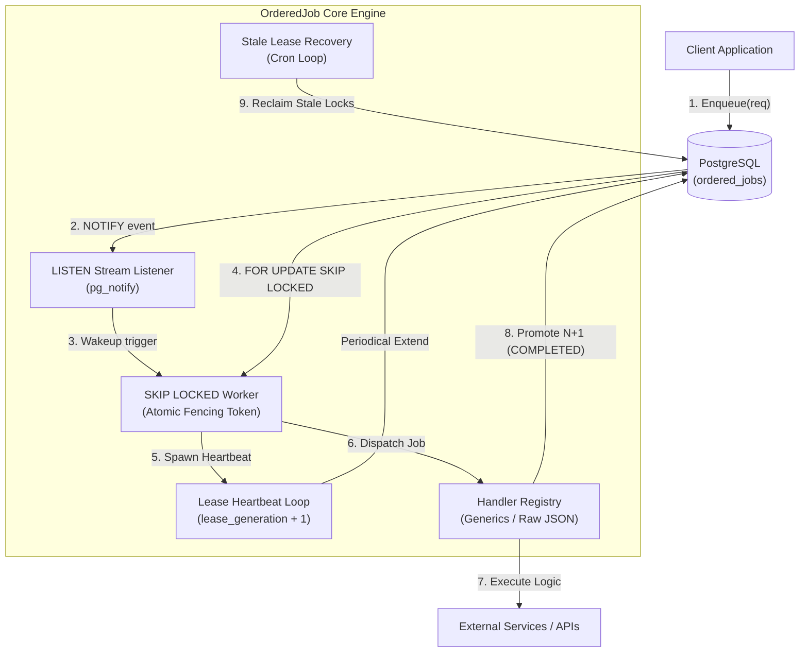
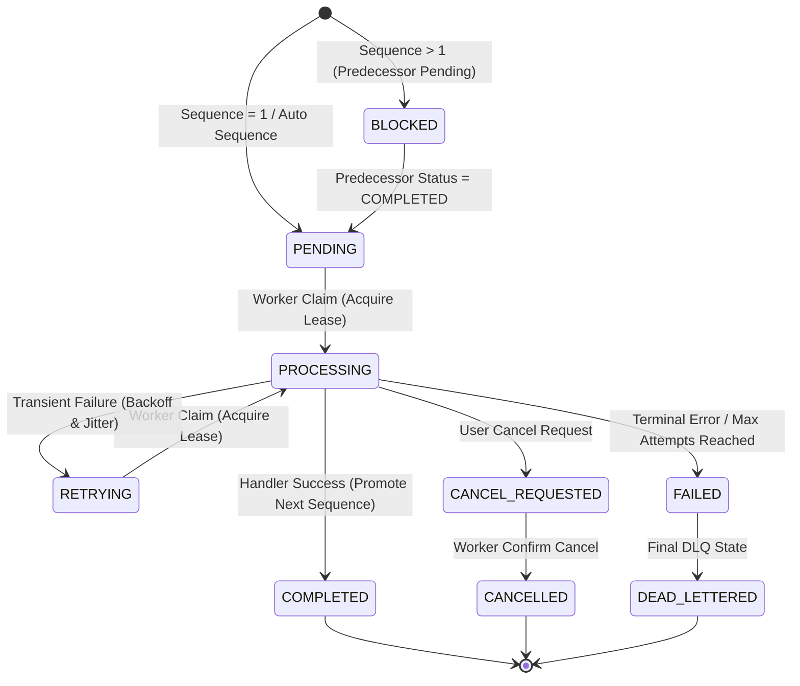

# 🏛️ Technical Architecture & Execution Lifecycle Specification (`orderedjob`)

Dokumen ini menjelaskan secara mendalam arsitektur teknis, model data, siklus hidup eksekusi (*execution lifecycle*), algoritma penguncian (*locking*), serta penanganan berbagai kondisi khusus (*edge cases*) pada pustaka **`orderedjob`**.

---

## 📌 Daftar Isi

- [1. Filosofi & Jaminan Sistem](#1-filosofi--jaminan-sistem)
- [2. Model Data & Skema Database](#2-model-data--skema-database)
- [3. Siklus Hidup Eksekusi Data (Step-by-Step)](#3-siklus-hidup-eksekusi-data-step-by-step)
  - [Fase 1: Ingesti Data (Enqueue Pipeline)](#fase-1-ingesti-data-enqueue-pipeline)
  - [Fase 2: Notifikasi & Klaim Pekerjaan (Claim Pipeline)](#fase-2-notifikasi--klaim-pekerjaan-claim-pipeline)
  - [Fase 3: Eksekusi Handler & Heartbeat (Execution Pipeline)](#fase-3-eksekusi-handler--heartbeat-execution-pipeline)
  - [Fase 4: Penyelesaian & Promosi Urutan (Completion Pipeline)](#fase-4-penyelesaian--promosi-urutan-completion-pipeline)
- [4. Diagram Arsitektur & State Machine](#4-diagram-arsitektur--state-machine)
- [5. Penanganan Edge Cases & Resiliensi Sistem](#5-penanganan-edge-cases--resiliensi-sistem)
- [6. Arsitektur Observabilitas (Metrik & Tracing)](#6-arsitektur-observabilitas-metrik--tracing)

---

## 1. Filosofi & Jaminan Sistem

`orderedjob` dirancang untuk menyelesaikan tantangan mendasar pada sistem terdistribusi: **menjamin urutan eksekusi pekerjaan secara ketat (Strict FIFO per Chain) tanpa mengorbankan throughput secara keseluruhan**.

### Jaminan Utama (*Core Guarantees*)
1. **Strict Per-Chain FIFO**: Job dengan `Sequence N` pada `ChainID X` **hanya dapat dieksekusi** setelah Job `Sequence N-1` berstatus `COMPLETED`.
2. **Inter-Chain Concurrency**: Pekerjaan pada chain `X` dan chain `Y` dieksekusi secara independen dan paralel tanpa saling mengunci (*zero cross-chain lock contention*).
3. **Sub-5ms Claim Latency**: Memanfaatkan transmisi terstruktur PostgreSQL `LISTEN/NOTIFY` untuk membangunkan worker goroutine seketika saat job baru hadir.
4. **Exactly-Once Semantics Guard (Fencing Token)**: Menggunakan `lease_generation` (fencing token) untuk mencegah efek samping ganda akibat worker yang mengalami *lagging* atau *network partition*.
5. **No Data Loss on Crashes**: Jika worker mati mendadak saat memproses pekerjaan, mekanisme *Stale Lease Recovery* akan otomatis memulihkan pekerjaan tersebut.

---

## 2. Model Data & Skema Database

Seluruh state penyimpanan dikelola di tabel PostgreSQL `ordered_jobs`. Skema dirancang dengan indeks parsial untuk memaksimalkan performa kueri klaim `FOR UPDATE SKIP LOCKED`.

### DDL Skema Tabel (`ordered_jobs`)

```sql
CREATE TABLE IF NOT EXISTS ordered_jobs (
    id              UUID PRIMARY KEY,
    chain_id        VARCHAR(255) NOT NULL,
    sequence        BIGINT NOT NULL,
    job_type        VARCHAR(255) NOT NULL,
    payload         JSONB NOT NULL,
    status          VARCHAR(50) NOT NULL,
    attempt         INT NOT NULL DEFAULT 0,
    max_attempts    INT NOT NULL DEFAULT 5,
    available_at    TIMESTAMPTZ NOT NULL DEFAULT NOW(),
    deadline_at     TIMESTAMPTZ,
    worker_id       VARCHAR(255),
    lease_until     TIMESTAMPTZ,
    lease_generation INT NOT NULL DEFAULT 0,
    last_error      TEXT,
    tenant_id       VARCHAR(255),
    idempotency_key VARCHAR(255),
    trace_id        VARCHAR(255),
    created_at      TIMESTAMPTZ NOT NULL DEFAULT NOW(),
    updated_at      TIMESTAMPTZ NOT NULL DEFAULT NOW(),
    started_at      TIMESTAMPTZ,
    completed_at    TIMESTAMPTZ,
    failed_at       TIMESTAMPTZ,

    CONSTRAINT uq_ordered_jobs_chain_sequence UNIQUE (chain_id, sequence)
);

-- Indeks Parsial Utama untuk Klaim Cepat (High-Throughput)
CREATE INDEX IF NOT EXISTS idx_ordered_jobs_claimable 
ON ordered_jobs (available_at, created_at) 
WHERE status IN ('PENDING', 'RETRYING');

CREATE INDEX IF NOT EXISTS idx_ordered_jobs_chain_sequence 
ON ordered_jobs (chain_id, sequence);
```

---

## 3. Siklus Hidup Eksekusi Data (Step-by-Step)

```
[Client Enqueue] ──> (1. Ingestion) ──> [PG Table: PENDING/BLOCKED]
                                                │
                                          (2. LISTEN/NOTIFY Wakeup)
                                                ▼
[Worker Pool] <── (3. FOR UPDATE SKIP LOCKED) ── [PG Table: PROCESSING]
      │
 (4. Heartbeat)
      │
 (5. Execution Result)
      ├── SUCCESS  ──> Update COMPLETED  ──> Unblock Sequence N+1 (BLOCKED -> PENDING)
      ├── RETRY    ──> Update RETRYING   ──> Recalculate Backoff + Jitter
      └── FAILURE  ──> Update FAILED/DLQ ──> Keep Chain Blocked (Order Safety)
```

### Fase 1: Ingesti Data (Enqueue Pipeline)

Ketika aplikasi memanggil `eng.Enqueue(ctx, req)` atau `eng.EnqueueBatch(ctx, reqs)`:

1. **Validasi Input**:
   - Memastikan `ChainID` dan `Type` tidak kosong.
   - Menolak sequence bernilai negatif.

2. **Deduplikasi Idempotensi (*Idempotency Key Check*)**:
   - Jika `IdempotencyKey` diisi, repository memeriksa apakah job dengan key tersebut sudah pernah di-enqueue.
   - Jika ditemukan, `orderedjob` langsung mengembalikan objek `Job` yang sudah ada tanpa membuat entitas ganda.

3. **Penanganan Auto-Sequence (`Sequence = 0`)**:
   - Jika `Sequence == 0`, `orderedjob` mengeksekusi PostgreSQL Advisory Lock pada hash `ChainID`:
     ```sql
     SELECT pg_advisory_xact_lock(hashtext($1));
     ```
   - Mengambil urutan tertinggi saat ini: `SELECT MAX(sequence) FROM ordered_jobs WHERE chain_id = $1`.
   - Jika belum ada job pada chain tersebut, urutan diberi nilai `1`. Jika sudah ada, urutan otomatis di-increment: `Sequence = MAX + 1`.

4. **Penentuan Status Awal (`PENDING` vs `BLOCKED`)**:
   - Jika `Sequence == 1`, status otomatis di-set ke **`PENDING`**.
   - Jika `Sequence > 1`, repository mengecek status pendahulu (`Sequence - 1`):
     - Jika pendahulu berstatus `COMPLETED`, status job baru di-set ke **`PENDING`**.
     - Jika pendahulu belum selesai (`PENDING`, `PROCESSING`, `RETRYING`, atau belum di-enqueue), status job baru di-set ke **`BLOCKED`**.

5. **Disparasi Notifikasi PostgreSQL**:
   - Setelah `INSERT` berhasil dikomit dalam transaksi DB, repository mengirimkan sinyal `NOTIFY ordered_jobs, 'chain_id'`.

---

### Fase 2: Notifikasi & Klaim Pekerjaan (Claim Pipeline)

Worker engine menjalankan dua mekanisme konsumsi paralel:

1. **Event-Driven Listener (`LISTEN Stream`)**:
   - Goroutine dedicated mendengarkan sinyal `LISTEN ordered_jobs`.
   - Ketika notifikasi masuk, worker pool langsung dibangunkan (latensi klaim `< 5ms`).

2. **Fallback Polling Scanner**:
   - Polling interval periodik (misal `100ms`) dengan *random jitter* untuk menjamin tidak ada job yang tertinggal jika terjadi *push notification drop*.

3. **Klaim Atomik dengan Fencing Token**:
   - Worker mengeksekusi kueri `Claim` atomik menggunakan `FOR UPDATE SKIP LOCKED`:

```sql
WITH target AS (
    SELECT j.id
    FROM ordered_jobs j
    WHERE j.status IN ('PENDING', 'RETRYING')
      AND j.available_at <= NOW()
      AND (j.sequence = 1 OR EXISTS (
          SELECT 1 FROM ordered_jobs p 
          WHERE p.chain_id = j.chain_id 
            AND p.sequence = j.sequence - 1 
            AND p.status = 'COMPLETED'
      ))
    ORDER BY j.available_at ASC, j.created_at ASC
    FOR UPDATE OF j SKIP LOCKED
    LIMIT 1
)
UPDATE ordered_jobs u
SET status = 'PROCESSING',
    worker_id = $1,
    lease_until = NOW() + $2::interval,
    lease_generation = lease_generation + 1,
    attempt = attempt + 1,
    started_at = COALESCE(started_at, NOW()),
    updated_at = NOW()
FROM target
WHERE u.id = target.id
RETURNING u.*;
```

---

### Fase 3: Eksekusi Handler & Heartbeat (Execution Pipeline)

1. **Spawning Heartbeat Manager**:
   - Saat job berhasil diklaim, goroutine heartbeat internal dinyalakan secara asinkron.
   - Setiap `leaseDuration / 3` (misal 5 detik sekali untuk lease 15 detik), heartbeat memperpanjang `lease_until` di database:
     ```sql
     UPDATE ordered_jobs 
     SET lease_until = NOW() + $1::interval 
     WHERE id = $2 AND worker_id = $3 AND lease_generation = $4;
     ```

2. **Eksekusi Handler dengan Generics & Context**:
   - Inject `TraceID` dan deadline context ke dalam handler.
   - Deserialisasi payload JSON secara otomatis untuk *type-safe handler* (`RegisterTyped[T]`).

---

### Fase 4: Penyelesaian & Promosi Urutan (Completion Pipeline)

Setelah handler selesai mengeksekusi:

#### Case A: Eksekusi Sukses (`err == nil`)
1. Transaksi database memperbarui status job menjadi **`COMPLETED`**.
2. **Promosi Atomik Sucessor**: Repository mencari job dengan `Sequence N+1` pada chain yang sama yang berstatus `BLOCKED`, lalu mengubah statusnya menjadi **`PENDING`**:
   ```sql
   UPDATE ordered_jobs 
   SET status = 'PENDING', updated_at = NOW() 
   WHERE chain_id = $1 AND sequence = $2 + 1 AND status = 'BLOCKED';
   ```
3. Worker memicu `NOTIFY` internal untuk segera memproses job `N+1` tersebut.

#### Case B: Kegagalan Transien (`orderedjob.Retryable(err)`)
1. Kebijakan retry (*exponential backoff + jitter*) menghitung penundaan eksekusi berikutnya.
2. Status job diperbarui menjadi **`RETRYING`** dengan `available_at = NOW() + backoffDelay`.
3. Job pendahulu tetap aman dan job berikutnya (`Sequence N+1`) tetap berstatus `BLOCKED`.

#### Case C: Error Permanen / Max Attempts Reached
1. Status job diperbarui menjadi **`FAILED`** (atau `DEAD_LETTERED`).
2. Pesan eror disimpan di kolom `last_error`.
3. **Penting**: Chain tetap terhenti (job `Sequence N+1` tetap `BLOCKED`) demi mencegah korupsi data sekuensial.

---

## 4. Diagram Arsitektur & State Machine

### Diagram Komponen & Alur Data

<div align="center">



</div>

---

### Diagram State Machine Pekerjaan

<div align="center">



</div>

---

## 5. Penanganan Edge Cases & Resiliensi Sistem

| Skenario Edge Case | Potensi Masalah | Solusi & Mekanisme Resiliensi `orderedjob` |
| :--- | :--- | :--- |
| **Worker Mati Mendadak (*Crash / Power Loss*)** | Job menggantung di status `PROCESSING` selamanya. | **Stale Lease Recovery Loop**: Recovery worker memindai job dengan `status = 'PROCESSING'` AND `lease_until < NOW()`, lalu memulihkan statusnya ke `PENDING`/`RETRYING` dan menaikkan `lease_generation`. |
| **Worker Lambat (*Network Lag / GC Pause*)** | Worker lama terbangun dan mencoba menyelesaikan job yang sudah di-reclaim worker lain. | **Fencing Token (`lease_generation`)**: Setiap `UPDATE status = 'COMPLETED'` memverifikasi `WHERE id = $1 AND lease_generation = $2`. Jika generation berbeda, SQL mengembalikan 0 rows dan menolak perubahan. |
| **Klaim Bersamaan pada Chain Sama (*Concurrent Enqueue*)** | Penomoran urutan bertabrakan (*race condition*). | **PostgreSQL Advisory Lock**: `SELECT pg_advisory_xact_lock(hashtext(chain_id))` memastikan alokasi urutan otomatis (`Sequence = 0`) dilakukan secara serial per chain. |
| **Enkui Melompati Urutan (*Sequence Gap*)** | Pengirim mengenkui `Sequence 5` padahal `Sequence 1..4` belum ada. | **Strict Gap Checking**: Database menolak enkui yang melompati urutan dan mengembalikan `ErrSequenceGap`. |
| **Duplikasi Enkui akibat Retry Client HTTP** | Job yang sama di-enqueue berulang kali. | **Idempotency Key Deduplication**: Kueri `SELECT ... WHERE idempotency_key = $1` mengembalikan objek Job yang sudah ada tanpa insert ganda. |
| **Pencegahan Busy-Polling pada Database** | Beban kueri `SELECT` berlebihan saat antrean kosong. | **PostgreSQL LISTEN/NOTIFY + SKIP LOCKED**: Worker tertidur dan hanya dipicu oleh sinyal event, dengan fallback polling interval ber-jitter acak. |
| **Pemulihan Manual Job Gagal (DLQ)** | Chain terhenti akibat 1 job gagal. | **API `ReplayJob` & `SkipJob`**: Operator dapat memicu `ReplayJob` (mencoba ulang) atau `SkipJob` (menandai `COMPLETED` untuk membuka unblock `Sequence N+1`). |

---

## 6. Arsitektur Observabilitas (Metrik & Tracing)

### Standar Metrik Prometheus & OpenTelemetry

`orderedjob` mengimplementasikan pengumpulan metrik tanpa *overhead* performa menggunakan operasi atomic:

```go
type Metrics interface {
	IncClaimed()
	IncCompleted(jobType string)
	IncFailed(jobType string)
	IncRetry(jobType string)
	ObserveExecDuration(jobType string, d time.Duration)
	ObserveQueueDelay(jobType string, d time.Duration)
	SetActiveLeases(n int)
	IncClaimConflicts()
	IncStaleRecovered(n int)
	IncBlockedChain()
}
```

### Propagasi Context Tracing (Distributed Tracing)

Trace ID disisipkan saat `Enqueue` dan secara otomatis dipropagasikan ke dalam `context.Context` worker handler:

```go
// Menyisipkan Trace ID pada Client
ctx = orderedjob.WithTraceID(ctx, "trace-abc-12345")
eng.Enqueue(ctx, req)

// Membaca Trace ID di Worker Handler
orderedjob.RegisterTyped(eng, "ProcessOrder", func(ctx context.Context, job orderedjob.Job, payload OrderPayload) error {
    traceID := orderedjob.ExtractTraceID(ctx)
    // Log terintegrasi dengan Trace ID...
    return nil
})
```
