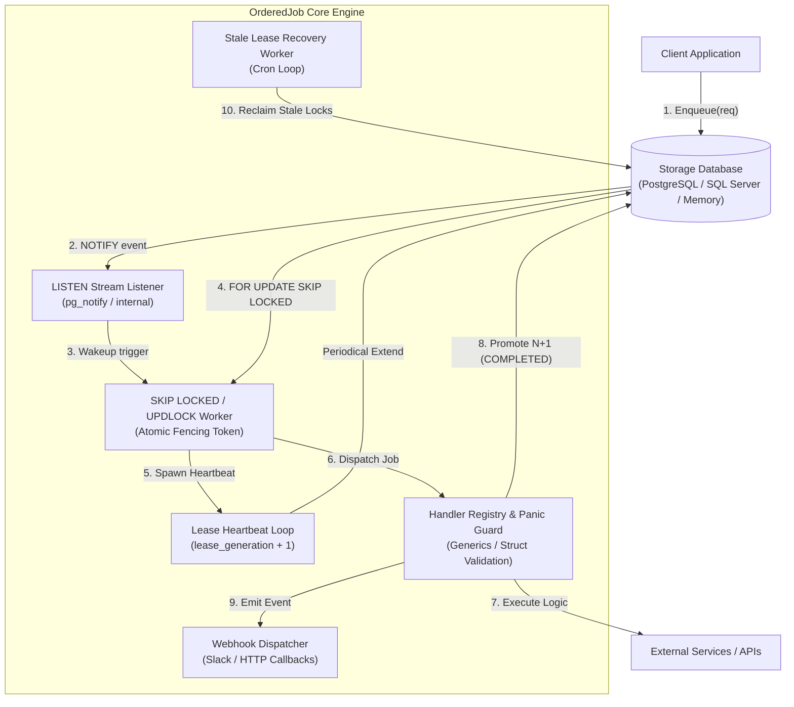
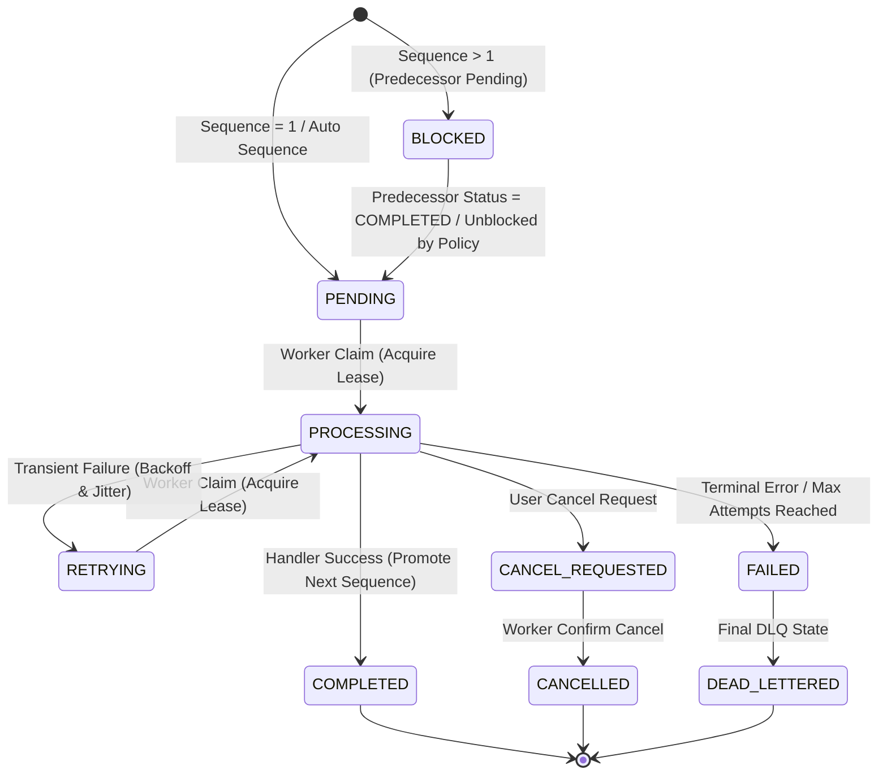

# 🏛️ Technical Architecture & Execution Lifecycle Specification (`orderedjob`)

Dokumen ini menjelaskan secara mendalam arsitektur teknis, model data, siklus hidup eksekusi (*execution lifecycle*), algoritma penguncian (*locking*), serta penanganan berbagai kondisi khusus (*edge cases*) dan benchmark performa pada pustaka **`orderedjob`**.

---

## 📌 Daftar Isi

- [1. Filosofi & Jaminan Sistem](#1-filosofi--jaminan-sistem)
- [2. Model Data & Skema Database](#2-model-data--skema-database)
- [3. Siklus Hidup Eksekusi Data (Step-by-Step)](#3-siklus-hidup-eksekusi-data-step-by-step)
  - [Fase 1: Ingesti Data (Enqueue Pipeline)](#fase-1-ingesti-data-enqueue-pipeline)
  - [Fase 2: Notifikasi & Klaim Pekerjaan (Claim Pipeline)](#fase-2-notifikasi--klaim-pekerjaan-claim-pipeline)
  - [Fase 3: Eksekusi Handler & Heartbeat (Execution Pipeline)](#fase-3-eksekusi-handler--heartbeat-execution-pipeline)
  - [Fase 4: Penyelesaian & Promosi Urutan (Completion Pipeline)](#fase-4-penyelesaian--promosi-urutan-completion-pipeline)
- [4. Diagram Arsitektur & State Machine](#4-diagram-arsitektur--state-machine)
- [5. Penanganan Edge Cases & Resiliensi Sistem](#5-penanganan-edge-cases--resiliensi-sistem)
- [6. Arsitektur Observabilitas (Metrik & Tracing)](#6-arsitektur-observabilitas-metrik--tracing)
- [7. Policy-Driven Execution & Dynamic Ordering Strategies](#7-policy-driven-execution--dynamic-ordering-strategies)
- [8. Worker Panic Isolation & Resiliency Guard](#8-worker-panic-isolation--resiliency-guard)
- [9. Advanced DLQ Engineering, Event Webhooks & Payload Editing](#9-advanced-dlq-engineering-event-webhooks--payload-editing)
- [10. Real-Time Web UI Architecture (SSE & Monitoring)](#10-real-time-web-ui-architecture-sse--monitoring)
- [11. Scalability & Lock Contention Benchmarks (Section 7.2)](#11-scalability--lock-contention-benchmarks-section-72)

---

## 1. Filosofi & Jaminan Sistem

`orderedjob` dirancang untuk menyelesaikan tantangan mendasar pada sistem terdistribusi: **menjamin urutan eksekusi pekerjaan secara ketat (Strict FIFO per Chain) tanpa mengorbankan throughput secara keseluruhan**.

### Jaminan Utama (*Core Guarantees*)
1. **Strict Per-Chain FIFO**: Job dengan `Sequence N` pada `ChainID X` **hanya dapat dieksekusi** setelah Job `Sequence N-1` berstatus `COMPLETED` (kecuali dikonfigurasi dengan opsi kebijakan non-strict).
2. **Inter-Chain Concurrency**: Pekerjaan pada chain `X` dan chain `Y` dieksekusi secara independen dan paralel tanpa saling mengunci (*zero cross-chain lock contention*).
3. **Sub-5ms Claim Latency**: Memanfaatkan transmisi terstruktur PostgreSQL `LISTEN/NOTIFY` (atau polling jitter) untuk membangunkan worker goroutine seketika saat job baru hadir.
4. **Exactly-Once Semantics Guard (Fencing Token)**: Menggunakan `lease_generation` (fencing token) untuk mencegah efek samping ganda akibat worker yang mengalami *lagging* atau *network partition*.
5. **No Data Loss on Crashes**: Jika worker mati mendadak saat memproses pekerjaan, mekanisme *Stale Lease Recovery* akan otomatis memulihkan pekerjaan tersebut.
6. **Multi-Database Support**: Adapter terintegrasi penuh untuk PostgreSQL (`SKIP LOCKED`), Microsoft SQL Server (`READPAST, UPDLOCK`), dan In-Memory engine.

---

## 2. Model Data & Skema Database

Seluruh state penyimpanan dikelola di tabel `ordered_jobs`. Skema dirancang dengan indeks parsial untuk memaksimalkan performa kueri klaim.

### DDL Skema Tabel PostgreSQL (`ordered_jobs`)

```sql
CREATE TABLE IF NOT EXISTS ordered_jobs (
    id              UUID PRIMARY KEY,
    chain_id        VARCHAR(255) NOT NULL,
    sequence        BIGINT NOT NULL,
    job_type        VARCHAR(255) NOT NULL,
    payload         JSONB NOT NULL,
    status          VARCHAR(50) NOT NULL,
    attempt         INT NOT NULL DEFAULT 0,
    max_attempts    INT NOT NULL DEFAULT 5,
    available_at    TIMESTAMPTZ NOT NULL DEFAULT NOW(),
    deadline_at     TIMESTAMPTZ,
    worker_id       VARCHAR(255),
    lease_until     TIMESTAMPTZ,
    lease_generation INT NOT NULL DEFAULT 0,
    last_error      TEXT,
    tenant_id       VARCHAR(255),
    idempotency_key VARCHAR(255),
    trace_id        VARCHAR(255),
    ordering_mode   VARCHAR(50) NOT NULL DEFAULT 'strict',
    created_at      TIMESTAMPTZ NOT NULL DEFAULT NOW(),
    updated_at      TIMESTAMPTZ NOT NULL DEFAULT NOW(),
    started_at      TIMESTAMPTZ,
    completed_at    TIMESTAMPTZ,
    failed_at       TIMESTAMPTZ,

    CONSTRAINT uq_ordered_jobs_chain_sequence UNIQUE (chain_id, sequence)
);

-- Indeks Parsial Utama untuk Klaim Cepat (High-Throughput)
CREATE INDEX IF NOT EXISTS idx_ordered_jobs_claimable 
ON ordered_jobs (available_at, created_at) 
WHERE status IN ('PENDING', 'RETRYING');

CREATE INDEX IF NOT EXISTS idx_ordered_jobs_chain_sequence 
ON ordered_jobs (chain_id, sequence);

CREATE INDEX IF NOT EXISTS idx_ordered_jobs_tenant 
ON ordered_jobs (tenant_id) WHERE tenant_id IS NOT NULL;

CREATE INDEX IF NOT EXISTS idx_ordered_jobs_idempotency 
ON ordered_jobs (idempotency_key) WHERE idempotency_key IS NOT NULL;
```

### DDL Skema Tabel Microsoft SQL Server (`ordered_jobs`)

```sql
IF NOT EXISTS (SELECT * FROM sys.tables WHERE name = 'ordered_jobs')
BEGIN
    CREATE TABLE ordered_jobs (
        id              UNIQUEIDENTIFIER PRIMARY KEY,
        chain_id        NVARCHAR(255) NOT NULL,
        sequence        BIGINT NOT NULL,
        job_type        NVARCHAR(255) NOT NULL,
        payload         NVARCHAR(MAX) NOT NULL,
        status          NVARCHAR(50) NOT NULL,
        attempt         INT NOT NULL DEFAULT 0,
        max_attempts    INT NOT NULL DEFAULT 5,
        available_at    DATETIMEOFFSET NOT NULL DEFAULT SYSDATETIMEOFFSET(),
        deadline_at     DATETIMEOFFSET NULL,
        worker_id       NVARCHAR(255) NULL,
        lease_until     DATETIMEOFFSET NULL,
        lease_generation INT NOT NULL DEFAULT 0,
        last_error      NVARCHAR(MAX) NULL,
        tenant_id       NVARCHAR(255) NULL,
        idempotency_key NVARCHAR(255) NULL,
        trace_id        NVARCHAR(255) NULL,
        ordering_mode   NVARCHAR(50) NOT NULL DEFAULT 'strict',
        created_at      DATETIMEOFFSET NOT NULL DEFAULT SYSDATETIMEOFFSET(),
        updated_at      DATETIMEOFFSET NOT NULL DEFAULT SYSDATETIMEOFFSET(),
        started_at      DATETIMEOFFSET NULL,
        completed_at    DATETIMEOFFSET NULL,
        failed_at       DATETIMEOFFSET NULL,

        CONSTRAINT uq_ordered_jobs_chain_sequence UNIQUE (chain_id, sequence)
    );
END;
```

---

## 3. Siklus Hidup Eksekusi Data (Step-by-Step)

```
[Client Enqueue] ──> (1. Ingestion) ──> [DB Table: PENDING/BLOCKED]
                                            │
                                      (2. LISTEN/NOTIFY Wakeup)
                                            ▼
[Worker Pool] <── (3. FOR UPDATE SKIP LOCKED / READPAST) ── [DB Table: PROCESSING]
      │
 (4. Heartbeat)
      │
 (5. Execution Result & Panic Guard)
      ├── SUCCESS  ──> Update COMPLETED  ──> Unblock Sequence N+1 (BLOCKED -> PENDING)
      ├── RETRY    ──> Update RETRYING   ──> Recalculate Backoff + Jitter
      └── FAILURE  ──> Update FAILED/DLQ ──> Handle per Ordering Policy (Strict/Skip/Continue)
```

### Fase 1: Ingesti Data (Enqueue Pipeline)

Ketika aplikasi memanggil `eng.Enqueue(ctx, req)` atau `eng.EnqueueBatch(ctx, reqs)`:

1. **Validasi Input**:
   - Memastikan `ChainID` dan `Type` tidak kosong.
   - Menolak sequence bernilai negatif.

2. **Deduplikasi Idempotensi (*Idempotency Key Check*)**:
   - Jika `IdempotencyKey` diisi, repository memeriksa apakah job dengan key tersebut sudah pernah di-enqueue.
   - Jika ditemukan, `orderedjob` langsung mengembalikan objek `Job` yang sudah ada tanpa membuat entitas ganda.

3. **Penanganan Auto-Sequence (`Sequence = 0`)**:
   - Jika `Sequence == 0`, `orderedjob` mengeksekusi penguncian transaksi khusus:
     - **PostgreSQL**: `SELECT pg_advisory_xact_lock(hashtext($1));`
     - **SQL Server**: `EXEC sp_getapplock @Resource = @chainID, @LockMode = 'Exclusive';`
   - Mengambil urutan tertinggi saat ini: `SELECT MAX(sequence) FROM ordered_jobs WHERE chain_id = $1`.
   - Urutan baru diberi nilai `MAX + 1` (atau `1` jika belum ada job).

4. **Penentuan Status Awal (`PENDING` vs `BLOCKED`)**:
   - Jika `Sequence == 1`, status otomatis di-set ke **`PENDING`**.
   - Jika `Sequence > 1`, repository mengecek status pendahulu (`Sequence - 1`):
     - Jika pendahulu berstatus `COMPLETED`, status job baru di-set ke **`PENDING`**.
     - Jika pendahulu belum selesai (`PENDING`, `PROCESSING`, `RETRYING`, atau belum di-enqueue), status job baru di-set ke **`BLOCKED`**.

5. **Disparasi Notifikasi Event**:
   - Mengirimkan sinyal `NOTIFY ordered_jobs, 'chain_id'` (PostgreSQL) atau memicu listener internal.

---

### Fase 2: Notifikasi & Klaim Pekerjaan (Claim Pipeline)

1. **Event-Driven Listener (`LISTEN Stream`)**:
   - Mendengarkan sinyal `LISTEN ordered_jobs` untuk membangunkan worker goroutine seketika (latensi klaim `< 5ms`).

2. **Fallback Polling Scanner**:
   - Polling interval periodik dengan *random jitter* untuk menjamin resiliensi dari *push notification drop*.

3. **Klaim Atomik dengan Fencing Token**:
   - Memanfaat kueri klaim atomik `FOR UPDATE SKIP LOCKED` (PostgreSQL) atau `WITH (UPDLOCK, READPAST)` (SQL Server):

```sql
WITH target AS (
    SELECT j.id
    FROM ordered_jobs j
    WHERE j.status IN ('PENDING', 'RETRYING')
      AND j.available_at <= NOW()
      AND (j.sequence = 1 OR EXISTS (
          SELECT 1 FROM ordered_jobs p 
          WHERE p.chain_id = j.chain_id 
            AND p.sequence = j.sequence - 1 
            AND p.status = 'COMPLETED'
      ))
    ORDER BY j.available_at ASC, j.created_at ASC
    FOR UPDATE OF j SKIP LOCKED
    LIMIT 1
)
UPDATE ordered_jobs u
SET status = 'PROCESSING',
    worker_id = $1,
    lease_until = NOW() + $2::interval,
    lease_generation = lease_generation + 1,
    attempt = attempt + 1,
    started_at = COALESCE(started_at, NOW()),
    updated_at = NOW()
FROM target
WHERE u.id = target.id
RETURNING u.*;
```

---

### Fase 3: Eksekusi Handler & Heartbeat (Execution Pipeline)

1. **Spawning Heartbeat Manager**:
   - Goroutine heartbeat internal dinyalakan secara asinkron setiap `leaseDuration / 3` untuk memperpanjang `lease_until` di database.

2. **Panic Recovery Guard**:
   - Worker membungkus eksekusi handler dengan `defer recover()` untuk menangkap unhandled panic dan mencatat stack trace tanpa menghentikan worker process.

3. **Context Injection & Generics**:
   - Inject `TraceID` dan deadline context ke dalam handler.
   - Deserialisasi payload JSON secara otomatis via `RegisterTyped[T]`.

---

### Fase 4: Penyelesaian & Promosi Urutan (Completion Pipeline)

1. **Eksekusi Sukses (`err == nil`)**:
   - Status diperbarui menjadi `COMPLETED`.
   - **Promosi Atomik**: Memperbarui status job `Sequence N+1` dari `BLOCKED` menjadi `PENDING`.

2. **Kegagalan Transien (`orderedjob.Retryable(err)`)**:
   - Mengaplikasikan *exponential backoff + jitter*.
   - Status diperbarui menjadi `RETRYING` dengan `available_at = NOW() + backoff`.

3. **Error Permanen / Max Attempts Reached**:
   - Status diperbarui menjadi `FAILED` / `DEAD_LETTERED`.
   - Perilaku promosi `Sequence N+1` ditentukan oleh **Ordering Mode**:
     - `strict`: Chain tetap terhenti (`BLOCKED`).
     - `skip-on-failure`: Job `Sequence N+1` otomatis dipromosikan ke `PENDING`.
     - `dead-letter-and-continue`: Job gagal dipindahkan ke DLQ dan `Sequence N+1` dibuka.

---

## 4. Diagram Arsitektur & State Machine

### Diagram Komponen & Alur Data

<div align="center">



</div>

---

### Diagram State Machine Pekerjaan

<div align="center">



</div>

---

## 5. Penanganan Edge Cases & Resiliensi Sistem

| Skenario Edge Case | Potensi Masalah | Solusi & Mekanisme Resiliensi `orderedjob` |
| :--- | :--- | :--- |
| **Worker Mati Mendadak (*Crash / Power Loss*)** | Job menggantung di status `PROCESSING` selamanya. | **Stale Lease Recovery Loop**: Memindai job `PROCESSING` dengan `lease_until < NOW()`, lalu memulihkan statusnya ke `PENDING`/`RETRYING` dan menaikkan `lease_generation`. |
| **Worker Lambat (*Network Lag / GC Pause*)** | Worker lama terbangun dan mencoba menyelesaikan job yang sudah di-reclaim worker lain. | **Fencing Token (`lease_generation`)**: Kueri `UPDATE status = 'COMPLETED'` memverifikasi `WHERE id = $1 AND lease_generation = $2`. Jika generation berbeda, perubahan ditolak. |
| **Klaim Bersamaan pada Chain Sama (*Concurrent Enqueue*)** | Penomoran urutan bertabrakan (*race condition*). | **Advisory Locking**: `pg_advisory_xact_lock` (PG) / `sp_getapplock` (MSSQL) memastikan alokasi urutan otomatis (`Sequence = 0`) dilakukan secara serial per chain. |
| **Unhandled Panic pada Handler Goroutine** | Worker goroutine mati mendadak dan aplikasi crash. | **Panic Recovery Guard**: Menangkap panic via `recover()`, mencatat stack trace lengkap, dan menandai job sebagai `FAILED`/`RETRYING` dengan aman. |
| **Enkui Melompati Urutan (*Sequence Gap*)** | Pengirim mengenkui `Sequence 5` padahal `Sequence 1..4` belum ada. | **Strict Gap Checking**: Database menolak enkui yang melompati urutan dan mengembalikan `ErrSequenceGap`. |
| **Duplikasi Enkui akibat Retry Client HTTP** | Job yang sama di-enqueue berulang kali. | **Idempotency Key Deduplication**: Kueri `SELECT ... WHERE idempotency_key = $1` mengembalikan objek Job yang sudah ada tanpa insert ganda. |
| **Pemulihan Manual Job Gagal (DLQ)** | Chain terhenti akibat 1 job gagal. | **Bulk DLQ API & Web UI**: Operator dapat memicu `BulkReplayDLQ`, `BulkSkipDLQ`, atau `BulkPurgeDLQ` dengan filter waktu, job type, dan error message. |

---

## 6. Arsitektur Observabilitas (Metrik & Tracing)

### Standar Metrik OpenTelemetry & Prometheus

`orderedjob` mengimplementasikan pengumpulan metrik tanpa *overhead* performa menggunakan operasi atomic:

```go
type Metrics interface {
	IncClaimed()
	IncCompleted(jobType string)
	IncFailed(jobType string)
	IncRetry(jobType string)
	ObserveExecDuration(jobType string, d time.Duration)
	ObserveQueueDelay(jobType string, d time.Duration)
	SetActiveLeases(n int)
	IncClaimConflicts()
	IncStaleRecovered(n int)
	IncBlockedChain()
}
```

### Propagasi Context Tracing (Distributed Tracing)

Trace ID disisipkan saat `Enqueue` dan secara otomatis dipropagasikan ke dalam `context.Context` worker handler:

```go
// Menyisipkan Trace ID pada Client
ctx = orderedjob.WithTraceID(ctx, "trace-abc-12345")
eng.Enqueue(ctx, req)

// Membaca Trace ID di Worker Handler
orderedjob.RegisterTyped(eng, "ProcessOrder", func(ctx context.Context, job orderedjob.Job, payload OrderPayload) error {
    traceID := orderedjob.ExtractTraceID(ctx)
    // Log terintegrasi dengan Trace ID...
    return nil
})
```

---

## 7. Policy-Driven Execution & Dynamic Ordering Strategies

Pustaka `orderedjob` menyediakan tiga moda urutan eksekusi (*ordering modes*) yang dapat disesuaikan per engine atau per job request:

1. **`OrderingModeStrict` (`"strict"`)**:
   - Mode default. Job `Sequence N` **wajib menunggu** hingga `Sequence N-1` berstatus `COMPLETED`. Jika `N-1` gagal (`FAILED`/`DEAD_LETTERED`), chain akan terhenti sampai diintervensi manual.
2. **`OrderingModeSkipOnFailure` (`"skip-on-failure"`)**:
   - Jika job `Sequence N-1` mengalami kegagalan terminal (DLQ), engine secara otomatis menandai kegagalan tersebut dan mempromosikan `Sequence N` ke status `PENDING`.
3. **`OrderingModeDeadLetterAndContinue` (`"dead-letter-and-continue"`)**:
   - Job yang gagal dipindahkan ke DLQ untuk inspeksi pasca-mortem, namun urutan berikutnya tetap dibuka agar tidak menghambat aliran data global.

### Dynamic Strategy Resolver

Anda dapat menentukan strategi urutan secara dinamis berdasarkan properti job request (misal per `tenant_id` atau `job_type`):

```go
eng := orderedjob.New(repo,
    orderedjob.WithOrderingStrategy(func(req orderedjob.EnqueueRequest) string {
        if req.Type == "AuditLog" {
            return orderedjob.OrderingModeSkipOnFailure
        }
        return orderedjob.OrderingModeStrict
    }),
)
```

---

## 8. Worker Panic Isolation & Resiliency Guard

Untuk mencegah kegagalan fatal (*unhandled panics*) pada logika bisnis user yang dapat menghentikan worker pool, `orderedjob` menyertakan Panic Recovery Guard bawaan:

- **Pengisolasi Panic**: Setiap eksekusi handler dibungkus dalam blok pemulihan isolasi.
- **Pencatatan Stacktrace**: Menangkap *stack trace* lengkap dan mencatatnya ke log terstruktur (`log/slog`).
- **Opsi Recovery & Retry**:
  ```go
  eng := orderedjob.New(repo,
      orderedjob.WithPanicHandler(func(ctx context.Context, job orderedjob.Job, panicVal any, stack []byte) error {
          // Custom logging atau alerting...
          return nil
      }),
      orderedjob.WithRetryOnPanic(true), // Mengizinkan retry jika terjadi panic
  )
  ```

---

## 9. Advanced DLQ Engineering, Event Webhooks & Payload Editing

`orderedjob` menyediakan API dan fitur operasional tingkat lanjut untuk mengelola antrean job yang bermasalah (DLQ):

### Bulk Operations API

```go
// Melakukan replay masal pada job gagal dengan kriteria tertentu
replayedCount, err := eng.BulkReplayDLQ(ctx, orderedjob.JobFilter{
    JobType: "ProcessPayment",
    Status:  orderedjob.StatusFailed,
})

// Melewati (skip) job bermasalah masal
skippedCount, err := eng.BulkSkipDLQ(ctx, orderedjob.JobFilter{
    CreatedBefore: time.Now().Add(-24 * time.Hour),
})
```

### Struct Validation & Payload Editing

Pendaftaran handler mendukung pengujian skema struct atau validator kustom sebelum payload diproses:

```go
orderedjob.RegisterTypedWithValidator(eng, "UpdateUser", 
    func(ctx context.Context, job orderedjob.Job, payload UserPayload) error {
        return nil
    },
    func(payload UserPayload) error {
        if payload.Email == "" {
            return errors.New("email required")
        }
        return nil
    },
)
```

### Event Listeners & Webhook Dispatcher

Integrasi callback untuk peristiwa penting seperti kegagalan job atau penumpukan DLQ:

```go
eng := orderedjob.New(repo,
    orderedjob.WithWebhook(orderedjob.WebhookConfig{
        URL:     "https://hooks.slack.com/services/...",
        Secret:  "whsec_xxx",
        Timeout: 5 * time.Second,
    }),
)
```

---

## 10. Real-Time Web UI Architecture (SSE & Monitoring)

Dashboard Web UI bawaan (`ui/`) dibangun dengan arsitektur modern tanpa dependensi berat:

- **Server-Sent Events (SSE)**: Streaming metrik dan perubahan status job secara real-time melalui endpoint `/ui/events`.
- **Search & Detail Modal**: Pencarian job berdasarkan `trace_id`, `chain_id`, `tenant_id`, atau `status`.
- **Payload Inspector & Editor**: Tampilan JSON payload terformat dengan sintaks yang rapi serta modal perbaikan payload secara interaktif.
- **Filtering & Sorting**: Fitur pagination, penataan kolom, dan status filter antrean.

---

## 11. Scalability & Lock Contention Benchmarks (Section 7.2)

Untuk memastikan pustaka mampu menangani beban kerja tingkat enterprise, `orderedjob` dilengkapi dengan suite pengujian performa skala besar (`engine_benchmark_test.go`):

### Suite Benchmark Utamanya

1. **`BenchmarkEngine_Scale100kChains`**:
   - Memulai eksekusi skala besar pada **100.000 concurrent chains** secara simultan.
   - Menguji pemrosesan paralel antar-chain dan mengonfirmasi **zero cross-chain lock contention**.
2. **`BenchmarkLockContention_AutoSequenceAdvisoryLock`**:
   - Pengujian enkui masal dengan pengalokasian urutan otomatis (`Sequence = 0`) di bawah persaingan goroutine yang intensif.
   - Menguji keandalan Advisory Lock (PostgreSQL `pg_advisory_xact_lock` / MSSQL `sp_getapplock`) dan mengonfirmasi **bebas dari kondisi deadlock**.
3. **`BenchmarkEngine_ClaimThroughput`**:
   - Mengukur throughput klaim job per detik (`ops/sec`) dan alokasi memori (`B/op`, `allocs/op`).

### Cara Menjalankan Benchmark

```bash
# Menjalankan seluruh suite benchmark dengan alokasi memori
go test -bench=. -benchmem ./...

# Menjalankan pengujian skala 100k chains secara spesifik
go test -bench=BenchmarkEngine_Scale100kChains -benchmem .
```
