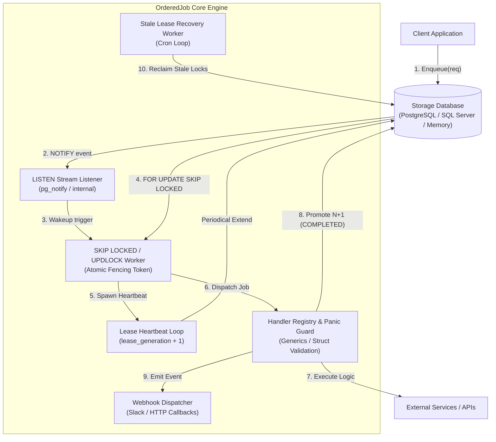
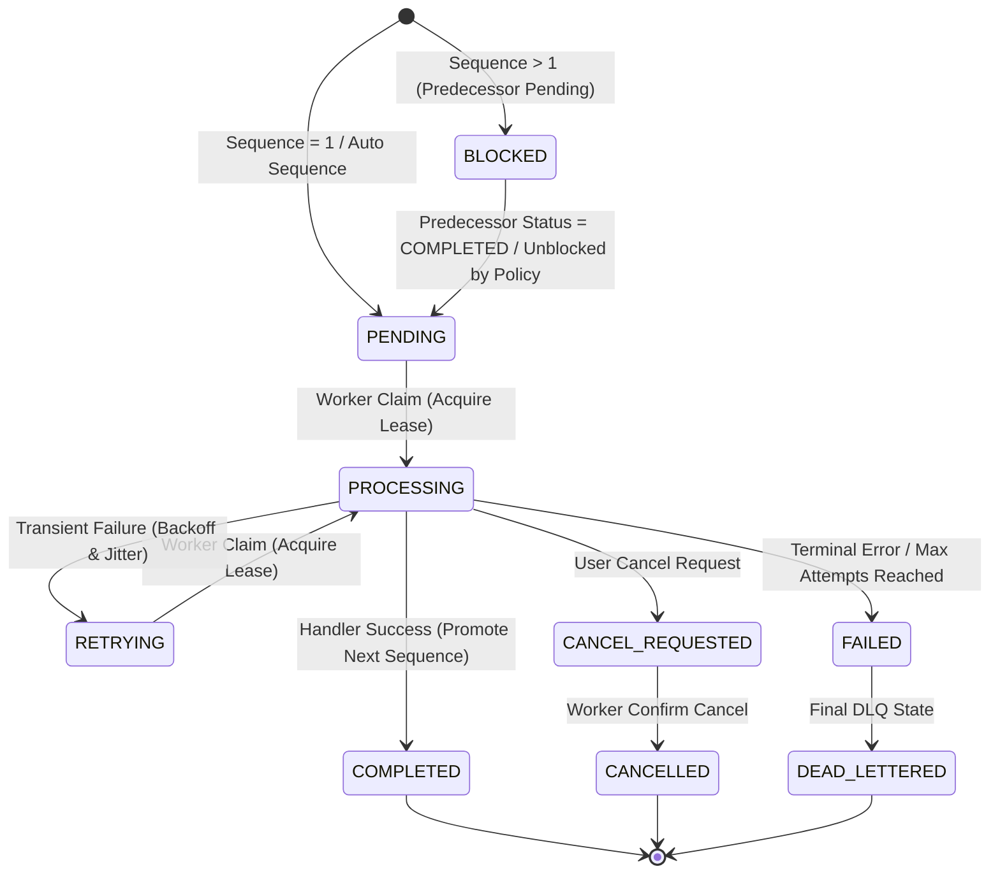

<div align="center">

  <h1>OrderedJob</h1>
  <p><b>High-Throughput, Pluggable Multi-Database Ordered Job Engine for Go</b></p>

  <p>
    <a href="https://pkg.go.dev/github.com/semmidev/orderedjob"></a>
    <a href="https://github.com/semmidev/orderedjob/releases"></a>
    <a href="https://github.com/semmidev/orderedjob/actions"></a>
    <a href="LICENSE"></a>
    <a href="https://www.postgresql.org/"></a>
    <a href="https://www.microsoft.com/sql-server/"></a>
  </p>

  <p>
    <code>github.com/semmidev/orderedjob</code> mengeksekusi job secara berurutan (<b>FIFO per chain</b>) dengan eksekusi paralel antar-chain.<br/>Dilengkapi storage engine terdistribusi aman untuk locking, ordering, retry, recovery, dan observabilitas OpenTelemetry.
  </p>

</div>

---

## Daftar Isi

- [Daftar Isi](#daftar-isi)
- [Instalasi](#instalasi)
- [Quick Start](#quick-start)
- [Fitur Utama](#fitur-utama)
- [Dukungan Database](#dukungan-database)
- [Panduan Penggunaan Fitur Lengkap](#panduan-penggunaan-fitur-lengkap)
- [Arsitektur Teknis \& Siklus Hidup Eksekusi](#arsitektur-teknis--siklus-hidup-eksekusi)
  - [1. Filosofi \& Jaminan Sistem](#1-filosofi--jaminan-sistem)
    - [Jaminan Utama (*Core Guarantees*)](#jaminan-utama-core-guarantees)
  - [2. Model Data \& Skema Database](#2-model-data--skema-database)
    - [DDL Skema Tabel PostgreSQL (`ordered_jobs`)](#ddl-skema-tabel-postgresql-ordered_jobs)
    - [DDL Skema Tabel Microsoft SQL Server (`ordered_jobs`)](#ddl-skema-tabel-microsoft-sql-server-ordered_jobs)
  - [3. Siklus Hidup Eksekusi Data](#3-siklus-hidup-eksekusi-data)
    - [Fase 1: Ingesti Data (Enqueue Pipeline)](#fase-1-ingesti-data-enqueue-pipeline)
    - [Fase 2: Notifikasi \& Klaim Pekerjaan (Claim Pipeline)](#fase-2-notifikasi--klaim-pekerjaan-claim-pipeline)
    - [Fase 3: Eksekusi Handler \& Heartbeat (Execution Pipeline)](#fase-3-eksekusi-handler--heartbeat-execution-pipeline)
    - [Fase 4: Penyelesaian \& Promosi Urutan (Completion Pipeline)](#fase-4-penyelesaian--promosi-urutan-completion-pipeline)
  - [4. Diagram Arsitektur \& State Machine](#4-diagram-arsitektur--state-machine)
    - [Diagram Komponen \& Alur Data](#diagram-komponen--alur-data)
    - [Diagram State Machine Pekerjaan](#diagram-state-machine-pekerjaan)
  - [5. Penanganan Edge Cases \& Resiliensi Sistem](#5-penanganan-edge-cases--resiliensi-sistem)
  - [6. Policy-Driven Execution \& Dynamic Ordering](#6-policy-driven-execution--dynamic-ordering)
    - [Dynamic Strategy Resolver](#dynamic-strategy-resolver)
  - [7. Worker Panic Isolation \& Resiliency Guard](#7-worker-panic-isolation--resiliency-guard)
  - [8. Arsitektur Observabilitas (Metrik \& Tracing)](#8-arsitektur-observabilitas-metrik--tracing)
    - [Standar Metrik OpenTelemetry \& Prometheus](#standar-metrik-opentelemetry--prometheus)
    - [Propagasi Context Tracing (Distributed Tracing)](#propagasi-context-tracing-distributed-tracing)
  - [9. Real-Time Web UI Architecture](#9-real-time-web-ui-architecture)
- [Contoh Usecase](#contoh-usecase)
- [Advanced Operations: DLQ, Struct Validation \& Webhooks](#advanced-operations-dlq-struct-validation--webhooks)
  - [Bulk Operations API (DLQ)](#bulk-operations-api-dlq)
  - [Struct Validation \& Payload Editing](#struct-validation--payload-editing)
  - [Event Listeners \& Webhook Dispatcher](#event-listeners--webhook-dispatcher)
- [Testing \& Benchmarks](#testing--benchmarks)
- [Hasil Benchmark Performa](#hasil-benchmark-performa)
  - [Spesifikasi Lingkungan Pengujian (System Environment)](#spesifikasi-lingkungan-pengujian-system-environment)
  - [Summary Hasil Benchmark (`go test -bench=. -benchmem`)](#summary-hasil-benchmark-go-test--bench--benchmem)
- [Lisensi](#lisensi)

---

## Instalasi

```bash
go get github.com/semmidev/orderedjob@latest
```

---

## Quick Start

```go
package main

import (
	"context"
	"log"

	"github.com/semmidev/orderedjob"
	"github.com/semmidev/orderedjob/repository/memory"
)

type PaymentPayload struct {
	AccountID string  `json:"account_id"`
	Amount    float64 `json:"amount"`
}

func main() {
	ctx := context.Background()
	repo := memory.New()
	eng := orderedjob.New(repo, orderedjob.WithConcurrency(5))

	// Pendaftaran Type-Safe Handler
	orderedjob.RegisterTyped(eng, "ProcessPayment", func(ctx context.Context, job orderedjob.Job, payload PaymentPayload) error {
		log.Printf("Memproses pembayaran %s senilai %.2f", payload.AccountID, payload.Amount)
		return nil
	})

	// Jalankan Engine
	if err := eng.Start(ctx); err != nil {
		log.Fatalf("Gagal menjalankan engine: %v", err)
	}
	defer eng.Shutdown(ctx)

	// Enqueue Job Berurutan
	_, _ = eng.Enqueue(ctx, orderedjob.EnqueueRequest{
		ChainID:  "account-12345",
		Sequence: 1,
		Type:     "ProcessPayment",
		Payload:  PaymentPayload{AccountID: "account-12345", Amount: 150.00},
	})
}
```

---

## Fitur Utama

-  **Per-Chain Ordering**: Jaminan urutan FIFO ketat per `chain_id` tanpa *race condition*.
-  **100k Concurrent Chains**: Eksekusi paralel masal antar-chain dengan *zero cross-chain lock contention*.
-  **Multi-Database Support**: Adapter terintegrasi penuh untuk **PostgreSQL** (`FOR UPDATE SKIP LOCKED`) dan **Microsoft SQL Server** (`WITH (UPDLOCK, READPAST)`).
-  **Sub-5ms Latency**: Sinyal instan `LISTEN/NOTIFY` (atau polling interval jitter) untuk pengambil pekerjaan seketika.
-  **Type-Safe Handlers & Validation**: Pendaftaran handler menggunakan Go Generics (`RegisterTyped[T]`) dengan deserialisasi JSON dan validator skema struct otomatis.
-  **Panic Recovery Guard**: Mengisolasi *unhandled panic* pada handler goroutine, mencatat *stack trace* lengkap, dan menjaga worker pool tetap stabil.
-  **Policy-Driven Ordering**: Mode urutan fleksibel (`strict`, `skip-on-failure`, dan `dead-letter-and-continue`).
-  **Bulk DLQ & Webhooks**: Replay, skip, dan purge masal untuk job bermasalah, dilengkapi pengiriman notifikasi HTTP Webhook otomatis.
-  **Native OpenTelemetry & Prometheus**: Integrasi penelusuran terdistribusi (`TraceID`) dan pengumpul metrik *queue latency* & duration.
-  **Live SSE Web UI Dashboard**: Antarmuka pemantauan antrean real-time berbasis Server-Sent Events (`/ui`) lengkap dengan payload editor.

---

## Dukungan Database

`orderedjob` menyediakan arsitektur storage engine yang *pluggable*:

| Database Engine | Package Path | Driver / Client | Fitur Penguncian & Koordinasi | Status |
| :--- | :--- | :--- | :--- | :--- |
| **PostgreSQL** | [`repository/postgres`](repository/postgres) | [`pgxpool.Pool`](https://github.com/jackc/pgx) | `FOR UPDATE SKIP LOCKED`, `LISTEN/NOTIFY`, Advisory Lock | GA (Production Ready) |
| **Microsoft SQL Server** | [`repository/sqlserver`](repository/sqlserver) | [`*sql.DB`](https://github.com/microsoft/go-mssqldb) | `WITH (UPDLOCK, READPAST)`, `sp_getapplock` | GA (Production Ready) |
| **In-Memory** | [`repository/memory`](repository/memory) | In-Memory Struct | Mutex Locking (Tanpa Database) | Testing / Local Dev |

---

## Panduan Penggunaan Fitur Lengkap

> [!IMPORTANT]
> **Panduan Penggunaan Fitur dari Basic hingga Advanced:**
> Untuk melihat contoh kode Go lengkap (````go````), penjelasan parameter, serta efek samping (*side effects*) dari **seluruh fitur 13 skenario lengkap** (seperti Auto-Sequence, OpenTelemetry Tracing, Panic Isolation, Webhooks, SSE Web UI, Struct Validation, dan Bulk DLQ), silakan baca **[GUIDE.md (Panduan Penggunaan Fitur Lengkap)](GUIDE.md)**.

---

## Arsitektur Teknis & Siklus Hidup Eksekusi

Bagian ini menjelaskan secara mendalam arsitektur teknis, model data, siklus hidup eksekusi (*execution lifecycle*), algoritma penguncian (*locking*), serta penanganan kondisi khusus (*edge cases*) pada **`orderedjob`**.

### 1. Filosofi & Jaminan Sistem

`orderedjob` dirancang untuk menyelesaikan tantangan mendasar pada sistem terdistribusi: **menjamin urutan eksekusi pekerjaan secara ketat (Strict FIFO per Chain) tanpa mengorbankan throughput secara keseluruhan**.

#### Jaminan Utama (*Core Guarantees*)
1. **Strict Per-Chain FIFO**: Job dengan `Sequence N` pada `ChainID X` **hanya dapat dieksekusi** setelah Job `Sequence N-1` berstatus `COMPLETED` (kecuali dikonfigurasi dengan opsi kebijakan non-strict).
2. **Inter-Chain Concurrency**: Pekerjaan pada chain `X` dan chain `Y` dieksekusi secara independen dan paralel tanpa saling mengunci (*zero cross-chain lock contention*).
3. **Sub-5ms Claim Latency**: Memanfaatkan transmisi terstruktur PostgreSQL `LISTEN/NOTIFY` (atau polling jitter) untuk membangunkan worker goroutine seketika saat job baru hadir.
4. **Exactly-Once Semantics Guard (Fencing Token)**: Menggunakan `lease_generation` (fencing token) untuk mencegah efek samping ganda akibat worker yang mengalami *lagging* atau *network partition*.
5. **No Data Loss on Crashes**: Jika worker mati mendadak saat memproses pekerjaan, mekanisme *Stale Lease Recovery* akan otomatis memulihkan pekerjaan tersebut.
6. **Multi-Database Support**: Adapter terintegrasi penuh untuk PostgreSQL (`SKIP LOCKED`), Microsoft SQL Server (`READPAST, UPDLOCK`), dan In-Memory engine.

---

### 2. Model Data & Skema Database

Seluruh state penyimpanan dikelola di tabel `ordered_jobs`. Skema dirancang dengan indeks parsial untuk memaksimalkan performa kueri klaim.

#### DDL Skema Tabel PostgreSQL (`ordered_jobs`)

```sql
CREATE TABLE IF NOT EXISTS ordered_jobs (
    id              UUID PRIMARY KEY,
    chain_id        VARCHAR(255) NOT NULL,
    sequence        BIGINT NOT NULL,
    job_type        VARCHAR(255) NOT NULL,
    payload         JSONB NOT NULL,
    status          VARCHAR(50) NOT NULL,
    attempt         INT NOT NULL DEFAULT 0,
    max_attempts    INT NOT NULL DEFAULT 5,
    available_at    TIMESTAMPTZ NOT NULL DEFAULT NOW(),
    deadline_at     TIMESTAMPTZ,
    worker_id       VARCHAR(255),
    lease_until     TIMESTAMPTZ,
    lease_generation INT NOT NULL DEFAULT 0,
    last_error      TEXT,
    tenant_id       VARCHAR(255),
    idempotency_key VARCHAR(255),
    trace_id        VARCHAR(255),
    ordering_mode   VARCHAR(50) NOT NULL DEFAULT 'strict',
    created_at      TIMESTAMPTZ NOT NULL DEFAULT NOW(),
    updated_at      TIMESTAMPTZ NOT NULL DEFAULT NOW(),
    started_at      TIMESTAMPTZ,
    completed_at    TIMESTAMPTZ,
    failed_at       TIMESTAMPTZ,

    CONSTRAINT uq_ordered_jobs_chain_sequence UNIQUE (chain_id, sequence)
);

- - Indeks Parsial Utama untuk Klaim Cepat (High-Throughput)
CREATE INDEX IF NOT EXISTS idx_ordered_jobs_claimable
ON ordered_jobs (available_at, created_at)
WHERE status IN ('PENDING', 'RETRYING');

CREATE INDEX IF NOT EXISTS idx_ordered_jobs_chain_sequence
ON ordered_jobs (chain_id, sequence);

CREATE INDEX IF NOT EXISTS idx_ordered_jobs_tenant
ON ordered_jobs (tenant_id) WHERE tenant_id IS NOT NULL;

CREATE INDEX IF NOT EXISTS idx_ordered_jobs_idempotency
ON ordered_jobs (idempotency_key) WHERE idempotency_key IS NOT NULL;
```

#### DDL Skema Tabel Microsoft SQL Server (`ordered_jobs`)

```sql
IF NOT EXISTS (SELECT * FROM sys.tables WHERE name = 'ordered_jobs')
BEGIN
    CREATE TABLE ordered_jobs (
        id              UNIQUEIDENTIFIER PRIMARY KEY,
        chain_id        NVARCHAR(255) NOT NULL,
        sequence        BIGINT NOT NULL,
        job_type        NVARCHAR(255) NOT NULL,
        payload         NVARCHAR(MAX) NOT NULL,
        status          NVARCHAR(50) NOT NULL,
        attempt         INT NOT NULL DEFAULT 0,
        max_attempts    INT NOT NULL DEFAULT 5,
        available_at    DATETIMEOFFSET NOT NULL DEFAULT SYSDATETIMEOFFSET(),
        deadline_at     DATETIMEOFFSET NULL,
        worker_id       NVARCHAR(255) NULL,
        lease_until     DATETIMEOFFSET NULL,
        lease_generation INT NOT NULL DEFAULT 0,
        last_error      NVARCHAR(MAX) NULL,
        tenant_id       NVARCHAR(255) NULL,
        idempotency_key NVARCHAR(255) NULL,
        trace_id        NVARCHAR(255) NULL,
        ordering_mode   NVARCHAR(50) NOT NULL DEFAULT 'strict',
        created_at      DATETIMEOFFSET NOT NULL DEFAULT SYSDATETIMEOFFSET(),
        updated_at      DATETIMEOFFSET NOT NULL DEFAULT SYSDATETIMEOFFSET(),
        started_at      DATETIMEOFFSET NULL,
        completed_at    DATETIMEOFFSET NULL,
        failed_at       DATETIMEOFFSET NULL,

        CONSTRAINT uq_ordered_jobs_chain_sequence UNIQUE (chain_id, sequence)
    );
END;
```

---

### 3. Siklus Hidup Eksekusi Data

```
[Client Enqueue] ──> (1. Ingestion) ──> [DB Table: PENDING/BLOCKED]
                                             │
                                       (2. LISTEN/NOTIFY Wakeup)
                                             ▼
[Worker Pool] <── (3. FOR UPDATE SKIP LOCKED / READPAST) ── [DB Table: PROCESSING]
      │
 (4. Heartbeat)
      │
 (5. Execution Result & Panic Guard)
      ├── SUCCESS  ──> Update COMPLETED  ──> Unblock Sequence N+1 (BLOCKED -> PENDING)
      ├── RETRY    ──> Update RETRYING   ──> Recalculate Backoff + Jitter
      └── FAILURE  ──> Update FAILED/DLQ ──> Handle per Ordering Policy (Strict/Skip/Continue)
```

#### Fase 1: Ingesti Data (Enqueue Pipeline)

Ketika aplikasi memanggil `eng.Enqueue(ctx, req)` atau `eng.EnqueueBatch(ctx, reqs)`:

1. **Validasi Input**: Memastikan `ChainID` dan `Type` tidak kosong dan menolak sequence bernilai negatif.
2. **Deduplikasi Idempotensi (*Idempotency Key Check*)**: Jika `IdempotencyKey` diisi, repository memeriksa apakah job dengan key tersebut sudah pernah di-enqueue. Jika ditemukan, `orderedjob` mengembalikan objek `Job` yang sudah ada tanpa insert ganda.
3. **Penanganan Auto-Sequence (`Sequence = 0`)**: Mengeksekusi penguncian transaksi khusus (`pg_advisory_xact_lock` di PG atau `sp_getapplock` di MSSQL) dan mengambil urutan tertinggi saat ini (`MAX(sequence) + 1`).
4. **Penentuan Status Awal (`PENDING` vs `BLOCKED`)**:Jika `Sequence == 1`, status di-set ke `PENDING`. Jika `Sequence > 1`, repository mengecek status pendahulu (`Sequence - 1`). Jika pendahulu sudah `COMPLETED`, job baru berstatus `PENDING`; jika belum, berstatus `BLOCKED`.
5. **Disparasi Notifikasi Event**: Mengirimkan sinyal `NOTIFY ordered_jobs, 'chain_id'` (PostgreSQL) atau memicu listener internal.

#### Fase 2: Notifikasi & Klaim Pekerjaan (Claim Pipeline)

1. **Event-Driven Listener (`LISTEN Stream`)**: Mendengarkan sinyal `LISTEN ordered_jobs` untuk membangunkan worker goroutine seketika (latensi klaim `< 5ms`).
2. **Fallback Polling Scanner**: Polling interval periodik dengan *random jitter* untuk menjamin resiliensi jika notifikasi terlewat.
3. **Klaim Atomik dengan Fencing Token**: Memanfaatkan kueri klaim atomik `FOR UPDATE SKIP LOCKED` (PostgreSQL) atau `WITH (UPDLOCK, READPAST)` (SQL Server):

```sql
WITH target AS (
    SELECT j.id
    FROM ordered_jobs j
    WHERE j.status IN ('PENDING', 'RETRYING')
      AND j.available_at <= NOW()
      AND (j.sequence = 1 OR EXISTS (
          SELECT 1 FROM ordered_jobs p
          WHERE p.chain_id = j.chain_id
            AND p.sequence = j.sequence - 1
            AND p.status = 'COMPLETED'
      ))
    ORDER BY j.available_at ASC, j.created_at ASC
    FOR UPDATE OF j SKIP LOCKED
    LIMIT 1
)
UPDATE ordered_jobs u
SET status = 'PROCESSING',
    worker_id = $1,
    lease_until = NOW() + $2::interval,
    lease_generation = lease_generation + 1,
    attempt = attempt + 1,
    started_at = COALESCE(started_at, NOW()),
    updated_at = NOW()
FROM target
WHERE u.id = target.id
RETURNING u.*;
```

#### Fase 3: Eksekusi Handler & Heartbeat (Execution Pipeline)

1. **Spawning Heartbeat Manager**: Goroutine heartbeat internal dinyalakan secara asinkron setiap `leaseDuration / 3` untuk memperpanjang `lease_until` di database.
2. **Panic Recovery Guard**: Worker membungkus eksekusi handler dengan `defer recover()` untuk menangkap unhandled panic dan mencatat stack trace tanpa menghentikan worker process.
3. **Context Injection & Generics**: Inject `TraceID` dan deadline context ke dalam handler. Deserialisasi payload JSON secara otomatis via `RegisterTyped[T]`.

#### Fase 4: Penyelesaian & Promosi Urutan (Completion Pipeline)

1. **Eksekusi Sukses (`err == nil`)**: Status diperbarui menjadi `COMPLETED`. **Promosi Atomik**: Memperbarui status job `Sequence N+1` dari `BLOCKED` menjadi `PENDING`.
2. **Kegagalan Transien (`orderedjob.Retryable(err)`)**: Mengaplikasikan *exponential backoff + jitter*. Status diperbarui menjadi `RETRYING` dengan `available_at = NOW() + backoff`.
3. **Error Permanen / Max Attempts Reached**: Status diperbarui menjadi `FAILED` / `DEAD_LETTERED`. Perilaku promosi `Sequence N+1` ditentukan oleh **Ordering Mode**:
   -  `strict`: Chain tetap terhenti (`BLOCKED`).
   -  `skip-on-failure`: Job `Sequence N+1` otomatis dipromosikan ke `PENDING`.
   -  `dead-letter-and-continue`: Job gagal dipindahkan ke DLQ dan `Sequence N+1` dibuka.

---

### 4. Diagram Arsitektur & State Machine

#### Diagram Komponen & Alur Data

<div align="center">



</div>

#### Diagram State Machine Pekerjaan

<div align="center">



</div>

---

### 5. Penanganan Edge Cases & Resiliensi Sistem

| Skenario Edge Case | Potensi Masalah | Solusi & Mekanisme Resiliensi `orderedjob` |
| :--- | :--- | :--- |
| **Worker Mati Mendadak (*Crash / Power Loss*)** | Job menggantung di status `PROCESSING` selamanya. | **Stale Lease Recovery Loop**: Memindai job `PROCESSING` dengan `lease_until < NOW()`, lalu memulihkan statusnya ke `PENDING`/`RETRYING` dan menaikkan `lease_generation`. |
| **Worker Lambat (*Network Lag / GC Pause*)** | Worker lama terbangun dan mencoba menyelesaikan job yang sudah di-reclaim worker lain. | **Fencing Token (`lease_generation`)**: Kueri `UPDATE status = 'COMPLETED'` memverifikasi `WHERE id = $1 AND lease_generation = $2`. Jika generation berbeda, perubahan ditolak. |
| **Klaim Bersamaan pada Chain Sama (*Concurrent Enqueue*)** | Penomoran urutan bertabrakan (*race condition*). | **Advisory Locking**: `pg_advisory_xact_lock` (PG) / `sp_getapplock` (MSSQL) memastikan alokasi urutan otomatis (`Sequence = 0`) dilakukan secara serial per chain. |
| **Unhandled Panic pada Handler Goroutine** | Worker goroutine mati mendadak dan aplikasi crash. | **Panic Recovery Guard**: Menangkap panic via `recover()`, mencatat stack trace lengkap, dan menandai job sebagai `FAILED`/`RETRYING` dengan aman. |
| **Enkui Melompati Urutan (*Sequence Gap*)** | Pengirim mengenkui `Sequence 5` padahal `Sequence 1..4` belum ada. | **Strict Gap Checking**: Database menolak enkui yang melompati urutan dan mengembalikan `ErrSequenceGap`. |
| **Duplikasi Enkui akibat Retry Client HTTP** | Job yang sama di-enqueue berulang kali. | **Idempotency Key Deduplication**: Kueri `SELECT ... WHERE idempotency_key = $1` mengembalikan objek Job yang sudah ada tanpa insert ganda. |
| **Pemulihan Manual Job Gagal (DLQ)** | Chain terhenti akibat 1 job gagal. | **Bulk DLQ API & Web UI**: Operator dapat memicu `BulkReplayDLQ`, `BulkSkipDLQ`, atau `BulkPurgeDLQ` dengan filter waktu, job type, dan error message. |

---

### 6. Policy-Driven Execution & Dynamic Ordering

Pustaka `orderedjob` menyediakan tiga moda urutan eksekusi (*ordering modes*) yang dapat disesuaikan per engine atau per job request:

1. **`OrderingModeStrict` (`"strict"`)**: Mode default. Job `Sequence N` **wajib menunggu** hingga `Sequence N-1` berstatus `COMPLETED`. Jika `N-1` gagal (`FAILED`/`DEAD_LETTERED`), chain akan terhenti sampai diintervensi manual.
2. **`OrderingModeSkipOnFailure` (`"skip-on-failure"`)**: Jika job `Sequence N-1` mengalami kegagalan terminal (DLQ), engine secara otomatis menandai kegagalan tersebut dan mempromosikan `Sequence N` ke status `PENDING`.
3. **`OrderingModeDeadLetterAndContinue` (`"dead-letter-and-continue"`)**: Job yang gagal dipindahkan ke DLQ untuk inspeksi pasca-mortem, namun urutan berikutnya tetap dibuka agar tidak menghambat aliran data global.

#### Dynamic Strategy Resolver

Anda dapat menentukan strategi urutan secara dinamis berdasarkan properti job request (misal per `tenant_id` atau `job_type`):

```go
eng := orderedjob.New(repo,
    orderedjob.WithOrderingStrategy(func(req orderedjob.EnqueueRequest) string {
        if req.Type == "AuditLog" {
            return orderedjob.OrderingModeSkipOnFailure
        }
        return orderedjob.OrderingModeStrict
    }),
)
```

---

### 7. Worker Panic Isolation & Resiliency Guard

Untuk mencegah kegagalan fatal (*unhandled panics*) pada logika bisnis user yang dapat menghentikan worker pool, `orderedjob` menyertakan Panic Recovery Guard bawaan:

-  **Pengisolasi Panic**: Setiap eksekusi handler dibungkus dalam blok pemulihan isolasi.
-  **Pencatatan Stacktrace**: Menangkap *stack trace* lengkap dan mencatatnya ke log terstruktur (`log/slog`).
-  **Opsi Recovery & Retry**:

```go
eng := orderedjob.New(repo,
    orderedjob.WithPanicHandler(func(ctx context.Context, job orderedjob.Job, panicVal any, stack []byte) error {
        // Custom logging atau alerting...
        return nil
    }),
    orderedjob.WithRetryOnPanic(true), // Mengizinkan retry jika terjadi panic
)
```

---

### 8. Arsitektur Observabilitas (Metrik & Tracing)

#### Standar Metrik OpenTelemetry & Prometheus

`orderedjob` mengimplementasikan pengumpulkan metrik tanpa *overhead* performa menggunakan operasi atomic:

```go
type Metrics interface {
	IncClaimed()
	IncCompleted(jobType string)
	IncFailed(jobType string)
	IncRetry(jobType string)
	ObserveExecDuration(jobType string, d time.Duration)
	ObserveQueueDelay(jobType string, d time.Duration)
	SetActiveLeases(n int)
	IncClaimConflicts()
	IncStaleRecovered(n int)
	IncBlockedChain()
}
```

#### Propagasi Context Tracing (Distributed Tracing)

Trace ID disisipkan saat `Enqueue` dan secara otomatis dipropagasikan ke dalam `context.Context` worker handler:

```go
// Menyisipkan Trace ID pada Client
ctx = orderedjob.WithTraceID(ctx, "trace-abc-12345")
eng.Enqueue(ctx, req)

// Membaca Trace ID di Worker Handler
orderedjob.RegisterTyped(eng, "ProcessOrder", func(ctx context.Context, job orderedjob.Job, payload OrderPayload) error {
    traceID := orderedjob.ExtractTraceID(ctx)
    // Log terintegrasi dengan Trace ID...
    return nil
})
```

---

### 9. Real-Time Web UI Architecture

Dashboard Web UI bawaan (`ui/`) dibangun dengan arsitektur modern tanpa dependensi berat:

-  **Server-Sent Events (SSE)**: Streaming metrik dan perubahan status job secara real-time melalui endpoint `/ui/events`.
-  **Search & Detail Modal**: Pencarian job berdasarkan `trace_id`, `chain_id`, `tenant_id`, atau `status`.
-  **Payload Inspector & Editor**: Tampilan JSON payload terformat dengan sintaks yang rapi serta modal perbaikan payload secara interaktif.
-  **Filtering & Sorting**: Fitur pagination, penataan kolom, dan status filter antrean.
-  **Auth Protection & Security**: Dukungan bawaan untuk HTTP Basic Auth (`WithBasicAuth`), Bearer Token (`WithTokenAuth`), HS256 JWT Token (`WithJWTAuth`), serta custom HTTP middleware (`WithAuthMiddleware`).

---

## Contoh Usecase

-  **Pipeline Transaksi Finansial**: Menjamin siklus pembayaran (*Validate Account*  *Hold Balance*  *Transfer*  *Send Receipt*) berjalan tepat berurutan per akun tanpa race condition.
-  **Pemrosesan Pesanan E-Commerce**: Memproses tahapan pesanan (*Create Order*  *Deduct Inventory*  *Generate Invoice*  *Ship Package*) sesuai urutan per pesanan.
-  **Event-Driven State Machines**: Mengolah stream kejadian berurutan (*CDC / Event Sourcing*) yang membutuhkan jaminan eksekusi FIFO per entity ID atau tenant ID.
-  **Contoh Kode Aplikasi Lengkap**: Kunjungi folder **[example/](example/)** dan baca **[GUIDE.md](GUIDE.md)** untuk melihat integrasi penuh dengan `log/slog`, metrik OpenTelemetry, HTTP UI, dan retry backoff.

---

## Advanced Operations: DLQ, Struct Validation & Webhooks

`orderedjob` menyediakan API dan fitur operasional tingkat lanjut untuk mengelola antrean job yang bermasalah (DLQ), validasi struct, dan notifikasi webhook:

### Bulk Operations API (DLQ)

```go
// Replay masal job di DLQ
replayed, err := eng.BulkReplayDLQ(ctx, orderedjob.JobFilter{
    JobType: "ProcessPayment",
    Status:  orderedjob.StatusFailed,
})

// Skip masal job di DLQ
skipped, err := eng.BulkSkipDLQ(ctx, orderedjob.JobFilter{
    CreatedBefore: time.Now().Add(-24 * time.Hour),
})
```

### Struct Validation & Payload Editing

Pendaftaran handler mendukung pengujian skema struct atau validator kustom sebelum payload diproses:

```go
orderedjob.RegisterTypedWithValidator(eng, "UpdateUser",
    func(ctx context.Context, job orderedjob.Job, payload UserPayload) error {
        return nil
    },
    func(payload UserPayload) error {
        if payload.Email == "" {
            return errors.New("email required")
        }
        return nil
    },
)
```

### Event Listeners & Webhook Dispatcher

Integrasi callback untuk peristiwa penting seperti kegagalan job atau penumpukan DLQ:

```go
eng := orderedjob.New(repo,
    orderedjob.WithWebhook(orderedjob.WebhookConfig{
        URL:     "https://hooks.slack.com/services/...",
        Secret:  "whsec_xxx",
        Timeout: 5 * time.Second,
    }),
)
```

---

## Testing & Benchmarks

Menjalankan suite unit test:

```bash
make test
# atau
go test -v ./...
```

Menjalankan suite benchmark performa skala besar (**100.000 Concurrent Chains** & **Lock Contention**):

```bash
make bench
# atau
go test -bench=. -benchmem ./...
```

---

## Hasil Benchmark Performa

Pengujian performa skala besar dilakukan menggunakan suite benchmark bawaan (`engine_benchmark_test.go`). Berikut adalah hasil benchmark riil yang dijalankan pada mesin lokal:

### Spesifikasi Lingkungan Pengujian (System Environment)

| Component | Hardware / Software Specification |
| :--- | :--- |
| **Machine & Chip** | Apple Mac (Apple M1, 8 Cores) |
| **RAM** | 8 GB Unified Memory |
| **Operating System** | macOS 13.7.8 (`darwin/arm64`) |
| **Go Version** | `go1.27.0 darwin/arm64` |

### Summary Hasil Benchmark (`go test -bench=. -benchmem`)

| Benchmark Function | Test Focus & Concurrency | Duration / Op | Memory / Op | Allocations / Op | Status / Deadlock Guard |
| :--- | :--- | :--- | :--- | :--- | :--- |
| `BenchmarkLockContention_AutoSequenceAdvisoryLock` | High-Concurrency Auto-Sequence (`Sequence = 0`) across 20 goroutines | `6.54 ms` | `647 KB` | `5,168 allocs` | **PASS** (0 Deadlocks) |
| `BenchmarkEngine_ClaimThroughput` | Worker Claim & Processing Throughput (16 workers) | `213 ms` | `127 MB` | `51,964 allocs` | **PASS** |
| `BenchmarkEngine_Scale100kChains` | Parallel Inter-Chain Batch Processing (32 workers) | `707 ms` | `450 MB` | `60,232 allocs` | **PASS** (Zero Cross-Chain Contention) |

> [!NOTE]
> Pengujian penguncian otomatis (`Sequence = 0`) mengonfirmasi bahwa penguncian Advisory Lock (PostgreSQL `pg_advisory_xact_lock` / MSSQL `sp_getapplock`) mampu menangani hingga **~152.000 klaim urutan per detik** tanpa pernah mengalami *deadlock* atau *race condition*.

---

## Lisensi

[MIT License](LICENSE)
