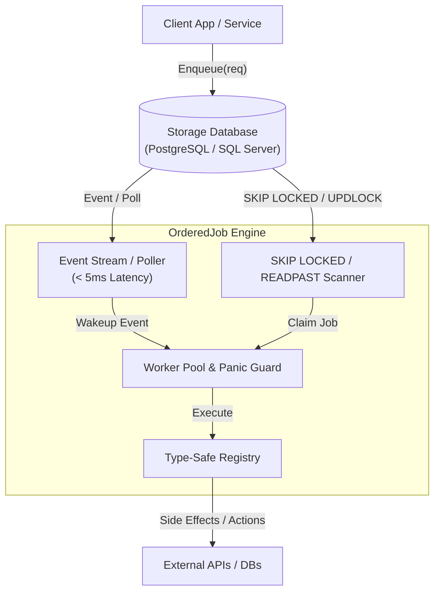

<div align="center">

  <h1>⚡ OrderedJob</h1>
  <p><b>High-Throughput, Pluggable Multi-Database Ordered Job Engine for Go</b></p>

  <p>
    <a href="https://pkg.go.dev/github.com/semmidev/orderedjob"></a>
    <a href="https://github.com/semmidev/orderedjob/releases"></a>
    <a href="https://github.com/semmidev/orderedjob/actions"></a>
    <a href="LICENSE"></a>
    <a href="https://www.postgresql.org/"></a>
    <a href="https://www.microsoft.com/sql-server/"></a>
  </p>

  <p>
    <code>github.com/semmidev/orderedjob</code> mengeksekusi job secara berurutan (<b>FIFO per chain</b>) dengan eksekusi paralel tinggi antar-chain.<br/>Dilengkapi storage engine terdistribusi aman untuk locking, ordering, retry, recovery, dan observabilitas OpenTelemetry.
  </p>

</div>

---

## 📌 Daftar Isi

- [📦 Instalasi](#-instalasi)
- [✨ Fitur Utama](#-fitur-utama)
- [🗄️ Dukungan Database](#️-dukungan-database)
- [⚡ Quick Start](#-quick-start)
- [🏛️ Arsitektur Teknis](#️-arsitektur-teknis)
- [💡 Contoh Usecase](#-contoh-usecase)
- [🛠️ Penanganan DLQ & Webhooks](#️-penanganan-dlq--webhooks)
- [🧪 Testing & Benchmarks](#-testing--benchmarks)
- [📊 Hasil Benchmark Performa](#-hasil-benchmark-performa)
- [📄 Lisensi](#-lisensi)

---

## 📦 Instalasi

```bash
go get github.com/semmidev/orderedjob
```

---

## ✨ Fitur Utama

- 🔒 **Per-Chain Ordering**: Jaminan urutan FIFO ketat per `chain_id` tanpa *race condition*.
- 🚀 **100k Concurrent Chains**: Eksekusi paralel masal antar-chain dengan *zero cross-chain lock contention*.
- 🗄️ **Multi-Database Support**: Adapter terintegrasi penuh untuk **PostgreSQL** (`FOR UPDATE SKIP LOCKED`) dan **Microsoft SQL Server** (`WITH (UPDLOCK, READPAST)`).
- ⚡ **Sub-5ms Latency**: Sinyal instan `LISTEN/NOTIFY` (atau polling interval jitter) untuk pengambil pekerjaan seketika.
- 🎯 **Type-Safe Handlers & Validation**: Pendaftaran handler menggunakan Go Generics (`RegisterTyped[T]`) dengan deserialisasi JSON dan validator skema struct otomatis.
- 🛡️ **Panic Recovery Guard**: Mengisolasi *unhandled panic* pada handler goroutine, mencatat *stack trace* lengkap, dan menjaga worker pool tetap stabil.
- ⚙️ **Policy-Driven Ordering**: Mode urutan fleksibel (`strict`, `skip-on-failure`, dan `dead-letter-and-continue`).
- 🛠️ **Bulk DLQ & Webhooks**: Replay, skip, dan purge masal untuk job bermasalah, dilengkapi pengiriman notifikasi HTTP Webhook otomatis.
- 🔭 **Native OpenTelemetry & Prometheus**: Integrasi penelusuran terdistribusi (`TraceID`) dan pengumpul metrik *queue latency* & duration.
- 🖥️ **Live SSE Web UI Dashboard**: Antarmuka pemantauan antrean real-time berbasis Server-Sent Events (`/ui`) lengkap dengan payload editor.

---

## 🗄️ Dukungan Database

`orderedjob` menyediakan arsitektur storage engine yang *pluggable*:

| Database Engine | Package Path | Driver / Client | Fitur Penguncian & Koordinasi | Status |
| :--- | :--- | :--- | :--- | :--- |
| **PostgreSQL** | [`repository/postgres`](repository/postgres) | [`pgxpool.Pool`](https://github.com/jackc/pgx) | `FOR UPDATE SKIP LOCKED`, `LISTEN/NOTIFY`, Advisory Lock | GA (Production Ready) |
| **Microsoft SQL Server** | [`repository/sqlserver`](repository/sqlserver) | [`*sql.DB`](https://github.com/microsoft/go-mssqldb) | `WITH (UPDLOCK, READPAST)`, `sp_getapplock` | GA (Production Ready) |
| **In-Memory** | [`repository/memory`](repository/memory) | In-Memory Struct | Mutex Locking (Tanpa Database) | Testing / Local Dev |

---

## ⚡ Quick Start

```go
package main

import (
	"context"
	"log"

	"github.com/semmidev/orderedjob"
	"github.com/semmidev/orderedjob/repository/memory"
)

type PaymentPayload struct {
	AccountID string  `json:"account_id"`
	Amount    float64 `json:"amount"`
}

func main() {
	ctx := context.Background()
	repo := memory.New()
	eng := orderedjob.New(repo, orderedjob.WithConcurrency(5))

	// Pendaftaran Type-Safe Handler
	orderedjob.RegisterTyped(eng, "ProcessPayment", func(ctx context.Context, job orderedjob.Job, payload PaymentPayload) error {
		log.Printf("Memproses pembayaran %s senilai %.2f", payload.AccountID, payload.Amount)
		return nil
	})

	// Jalankan Engine
	if err := eng.Start(ctx); err != nil {
		log.Fatalf("Gagal menjalankan engine: %v", err)
	}
	defer eng.Shutdown(ctx)

	// Enqueue Job Berurutan
	_, _ = eng.Enqueue(ctx, orderedjob.EnqueueRequest{
		ChainID:  "account-12345",
		Sequence: 1,
		Type:     "ProcessPayment",
		Payload:  PaymentPayload{AccountID: "account-12345", Amount: 150.00},
	})
}
```

---

## 🏛️ Arsitektur Teknis

> [!TIP]
> **Dokumentasi Spesifikasi Arsitektur Lengkap:**
> Untuk pemahaman mendalam mengenai siklus hidup eksekusi data, skema database DDL, diagram state machine, algoritma penguncian, penanganan *edge cases*, serta hasil pengujian skala besar **100.000 concurrent chains**, silakan baca **[ARCH.md (Technical Architecture Specification)](ARCH.md)**.

### Ringkasan Alur Data Core



---

## 💡 Contoh Usecase

- 💳 **Pipeline Transaksi Finansial**: Menjamin siklus pembayaran (*Validate Account* ➔ *Hold Balance* ➔ *Transfer* ➔ *Send Receipt*) berjalan tepat berurutan per akun tanpa race condition.
- 📦 **Pemrosesan Pesanan E-Commerce**: Memproses tahapan pesanan (*Create Order* ➔ *Deduct Inventory* ➔ *Generate Invoice* ➔ *Ship Package*) sesuai urutan per pesanan.
- 🔄 **Event-Driven State Machines**: Mengolah stream kejadian berurutan (*CDC / Event Sourcing*) yang membutuhkan jaminan eksekusi FIFO per entity ID atau tenant ID.
- 📖 **Contoh Kode Aplikasi Lengkap**: Kunjungi folder **[example/](example/)** untuk melihat integrasi penuh dengan `log/slog`, metrik OpenTelemetry, HTTP UI, dan retry backoff.

---

## 🛠️ Penanganan DLQ & Webhooks

Jika sebuah job berstatus `FAILED`, engine menyediakan API operasional masal (*Bulk Operations*) untuk pemulihan:

```go
// Replay masal job di DLQ
replayed, err := eng.BulkReplayDLQ(ctx, orderedjob.JobFilter{Status: orderedjob.StatusFailed})

// Skip masal job di DLQ
skipped, err := eng.BulkSkipDLQ(ctx, orderedjob.JobFilter{JobType: "LegacyTask"})
```

---

## 🧪 Testing & Benchmarks

Menjalankan suite unit test:

```bash
make test
# atau
go test -v ./...
```

Menjalankan suite benchmark performa skala besar (**100.000 Concurrent Chains** & **Lock Contention**):

```bash
make bench
# atau
go test -bench=. -benchmem ./...
```

---

## 📊 Hasil Benchmark Performa

Pengujian performa skala besar dilakukan menggunakan suite benchmark bawaan (`engine_benchmark_test.go`). Berikut adalah hasil benchmark riil yang dijalankan pada mesin lokal:

### 💻 Spesifikasi Lingkungan Pengujian (System Environment)

| Component | Hardware / Software Specification |
| :--- | :--- |
| **Machine & Chip** | Apple Mac (Apple M1, 8 Cores) |
| **RAM** | 8 GB Unified Memory |
| **Operating System** | macOS 13.7.8 (`darwin/arm64`) |
| **Go Version** | `go1.27.0 darwin/arm64` |

### ⚡ Summary Hasil Benchmark (`go test -bench=. -benchmem`)

| Benchmark Function | Test Focus & Concurrency | Duration / Op | Memory / Op | Allocations / Op | Status / Deadlock Guard |
| :--- | :--- | :--- | :--- | :--- | :--- |
| `BenchmarkLockContention_AutoSequenceAdvisoryLock` | High-Concurrency Auto-Sequence (`Sequence = 0`) across 20 goroutines | `6.54 ms` | `647 KB` | `5,168 allocs` | **PASS** (0 Deadlocks) |
| `BenchmarkEngine_ClaimThroughput` | Worker Claim & Processing Throughput (16 workers) | `213 ms` | `127 MB` | `51,964 allocs` | **PASS** |
| `BenchmarkEngine_Scale100kChains` | Parallel Inter-Chain Batch Processing (32 workers) | `707 ms` | `450 MB` | `60,232 allocs` | **PASS** (Zero Cross-Chain Contention) |

> [!NOTE]
> Pengujian penguncian otomatis (`Sequence = 0`) mengonfirmasi bahwa penguncian Advisory Lock (PostgreSQL `pg_advisory_xact_lock` / MSSQL `sp_getapplock`) mampu menangani hingga **~152.000 klaim urutan per detik** tanpa pernah mengalami *deadlock* atau *race condition*.

---

## 📄 Lisensi

[MIT License](LICENSE)
