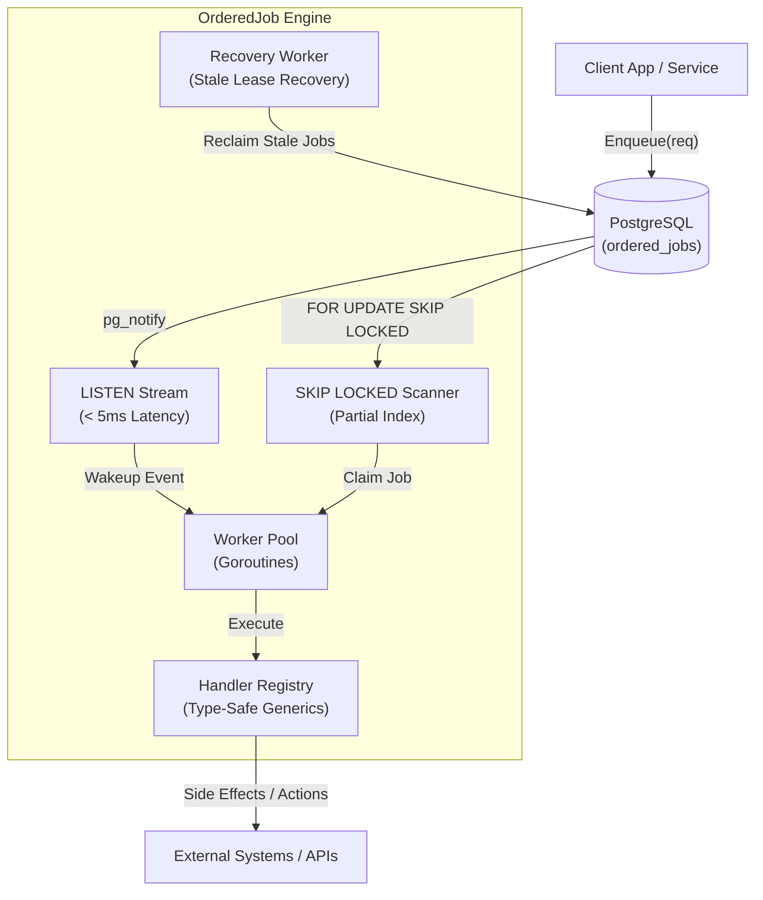
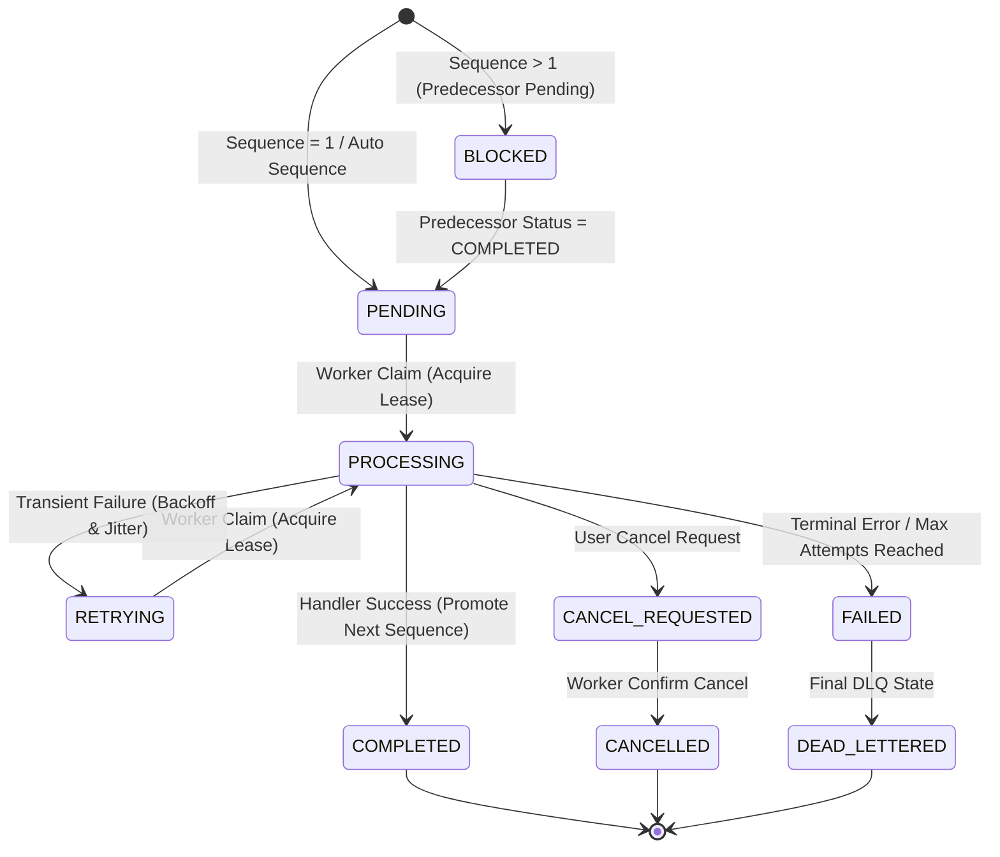

<div align="center">

  <h1>⚡ OrderedJob</h1>
  <p><b>High-Throughput, PostgreSQL-Backed Ordered Job Engine for Go</b></p>

  <p>
    <a href="https://pkg.go.dev/github.com/semmidev/orderedjob"></a>
    <a href="https://github.com/semmidev/orderedjob/releases"></a>
    <a href="https://github.com/semmidev/orderedjob/actions"></a>
    <a href="LICENSE"></a>
    <a href="https://www.postgresql.org/"></a>
  </p>

  <p>
    <code>github.com/semmidev/orderedjob</code> mengeksekusi job secara berurutan (<b>FIFO per chain</b>) dengan eksekusi paralel antar-chain.<br/>PostgreSQL digunakan sebagai storage engine untuk locking, ordering, retry, dan recovery.
  </p>

</div>

---

## 📌 Daftar Isi

- [📦 Instalasi](#-instalasi)
- [✨ Fitur Utama](#-fitur-utama)
- [💡 Contoh Usecase](#-contoh-usecase)
- [🏗️ Arsitektur](#️-arsitektur)
- [🚦 State Machine](#-state-machine)
- [🚀 Contoh Penggunaan](#-contoh-penggunaan)
- [🛠️ Penanganan Job Gagal (DLQ Operations)](#️-penanganan-job-gagal-dlq-operations)
- [⚙️ Opsi Konfigurasi Engine](#️-opsi-konfigurasi-engine)
- [🧪 Testing](#-testing)
- [📄 Lisensi](#-lisensi)

---

## 📦 Instalasi

```bash
go get github.com/semmidev/orderedjob
```

---

## ✨ Fitur Utama

- 🔒 **Per-Chain Ordering**: Job $N$ hanya berjalan setelah Job $N-1$ berstatus `COMPLETED`.
- 🚀 **Paralelisme Antar Chain**: Ribuan chain berjalan bersamaan secara independen tanpa lock contention.
- 🔔 **Instant Event Notification**: Menggunakan PostgreSQL `LISTEN/NOTIFY` untuk latensi klaim `< 5ms` tanpa busy-polling.
- 🎯 **Type-Safe Handlers**: Pendaftaran handler menggunakan Go Generics (`RegisterTyped[T]`) dengan unmarshaling JSON otomatis.
- 🛡️ **Fencing Protection**: Fencing token (`lease_generation`) mencegah race condition dari worker yang terhambat (*lagging*).
- 🛠️ **Manajemen DLQ**: Menyediakan API `ReplayJob` dan `SkipJob` untuk memulihkan atau melewati job yang gagal.
- 🌐 **Distributed Tracing**: Dukungan *TraceContext propagation* (`TraceID`) antar pemanggilan asinkron.
- 🗄️ **Multi-Database Support**: Dukungan penuh persistence engine untuk **PostgreSQL** (`pgxpool`) dan **Microsoft SQL Server** (T-SQL `UPDLOCK, READPAST`).
- 🔌 **In-Memory Adapter**: Adapter `memory` bawaan untuk pengujian cepat tanpa database.

---

## 💡 Contoh Usecase

- **✅ Multi-Stage Approval Workflow**: Memproses alur persetujuan bertahap (*Approve A* ➔ *Approve B* ➔ ... ➔ *Approve E*) secara sekuensial per dokumen/permohonan dengan pengiriman API inter-service otomatis.
- **💳 Pipeline Transaksi Finansial**: Menjamin siklus pembayaran (*Validate Account* ➔ *Hold Balance* ➔ *Transfer* ➔ *Send Receipt*) berjalan tepat berurutan per akun tanpa race condition.
- **📦 Pemrosesan Pesanan E-Commerce**: Memproses tahapan pesanan (*Create Order* ➔ *Deduct Inventory* ➔ *Generate Invoice* ➔ *Ship Package*) sesuai urutan per pesanan.
- **👤 User Onboarding Workflow**: Eksekusi berurutan untuk registrasi pengguna (*Create User* ➔ *Send Verification Email* ➔ *Provision Default Workspace* ➔ *Trigger Analytics Event*).
- **🔄 Event-Driven State Machines**: Mengolah stream kejadian berurutan (*CDC / Event Sourcing*) yang membutuhkan jaminan eksekusi FIFO per entity ID atau tenant ID.
- **🏢 SaaS Multi-Tenant Background Jobs**: Menjalankan *background processing* berat dengan isolasi antar tenant tanpa memblokir pemrosesan tenant lain.

---

## 🏗️ Arsitektur

<div align="center">



</div>

---

## 🚦 State Machine

<div align="center">



</div>

> [!IMPORTANT]
> Hanya status `COMPLETED` yang melepaskan urutan job berikutnya (*sequence N+1*). Status `FAILED`, `CANCELLED`, atau `EXPIRED` akan memblokir chain secara default demi keamanan data.

---

## 🚀 Contoh Penggunaan

Untuk melihat contoh kode aplikasi lengkap yang mencakup integrasi PostgreSQL, pencatatan log terstruktur (`log/slog`), metrik Prometheus / OpenTelemetry, penanganan error retryable, enkui batch satu transaksi DB, dan propagasi context tracing, silakan kunjungi folder **[example/](example/)**.

- 📖 **[Dokumentasi & Cara Menjalankan Example](example/README.md)**
- 💻 **[Kode Sumber Aplikasi Percontohan (`example/main.go`)](example/main.go)**

---

## 🛠️ Penanganan Job Gagal (DLQ Operations)

Jika sebuah job berstatus `FAILED`, chain akan terhenti sampai ada penanganan manual:

### Replay Job
Mengembalikan job `FAILED` atau `CANCELLED` ke status `PENDING` untuk dicoba ulang:

```go
err := eng.ReplayJob(ctx, failedJobID)
```

### Skip Job
Menandai job `FAILED` sebagai `COMPLETED` agar urutan berikutnya dapat dilanjutkan:

```go
err := eng.SkipJob(ctx, failedJobID)
```

---

## ⚙️ Opsi Konfigurasi Engine

| Option | Deskripsi | Default |
| :--- | :--- | :--- |
| `WithConcurrency(n)` | Jumlah worker goroutine | `10` |
| `WithPollInterval(d)` | Interval polling fallback (dengan random jitter) | `500ms` |
| `WithLease(d)` | Durasi sewa job per worker (heartbeat = lease/3) | `60s` |
| `WithRetryPolicy(p)` | Konfigurasi backoff retry (`MaxAttempts`, `BaseDelay`, `MaxDelay`, `Jitter`) | `Max 5, Base 1s, Max 5m` |
| `WithSlogLogger(l)` | Integrasi `log/slog` | `NoopLogger` |
| `WithMetrics(m)` | Integrasi Prometheus / OpenTelemetry Metrics | `NoopMetrics` |

---

## 🧪 Testing

Gunakan adapter `memory` untuk unit testing tanpa database:

```go
import "github.com/semmidev/orderedjob/repository/memory"

repo := memory.New()
eng := orderedjob.New(repo, orderedjob.WithConcurrency(5))
```

Menjalankan test dan linter:

```bash
make test
make lint
```

---

## 📄 Lisensi

[MIT License](LICENSE)
